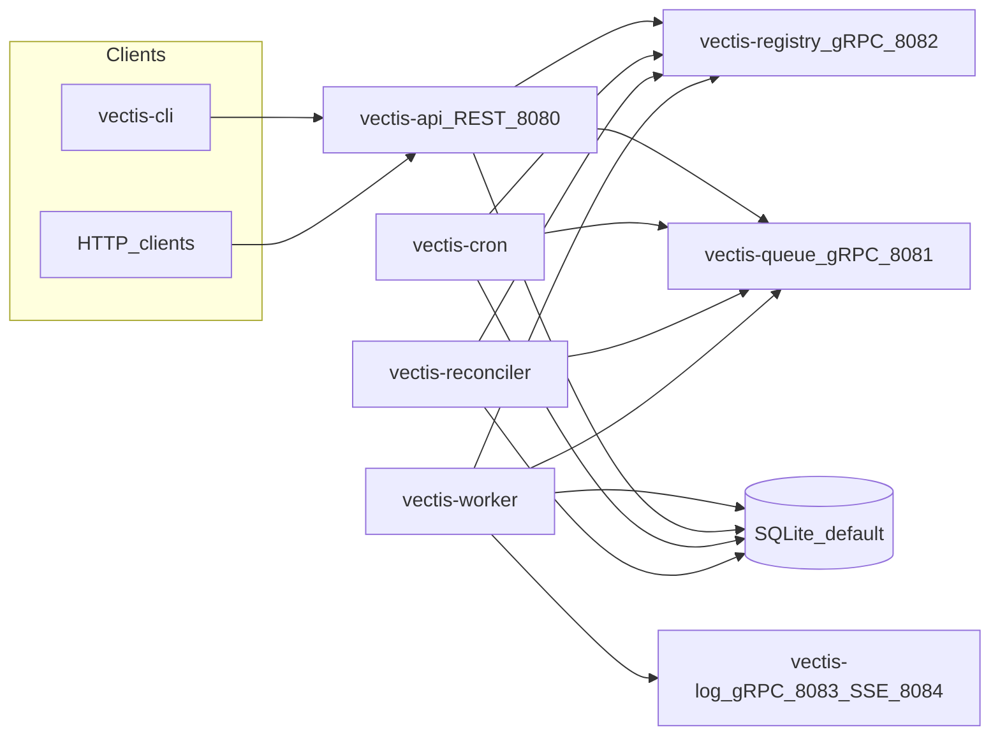

# Vectis - Modern Build System Planning Document

## 1. Project Overview

**Vectis** is a self-hosted, modern build system inspired by Jenkins, designed for large-scale CI/CD workloads. It provides a component-based architecture with well-defined boundaries, enabling independent replacement, upgrade, and reimplementation of each component.

**Design goals:**

- Language-agnostic component boundaries (gRPC + JSON REST)
- Scale to hundreds of builds/day initially; validated scale targets added as benchmarks are performed
- Easy local development + production-grade deployment
- Database agnostic in principle: **defaults are SQLite**; PostgreSQL-oriented production requires migration driver work, not only configuration (see §2.5)
- No required external dependencies beyond storage for the current stack
- Vectis tests Vectis (dogfooding) — aspiration for CI

**Naming conventions (implemented vs target):**

- **Pipeline file (target):** `.vectis.yml` — not yet loaded by the runtime; jobs today are JSON matching the protobuf `Job` shape (`api/proto/common.proto`).
- **Binaries (implemented):** `vectis-local`, `vectis-api`, `vectis-queue`, `vectis-worker`, `vectis-log`, `vectis-registry`, `vectis-cron`, `vectis-reconciler`, `vectis-cli` — built via `Makefile` into `bin/vectis-*`.
- **Docker images (target / future):** `vectis/*`
- **Config paths (target prod layout):** `/etc/vectis/`, `/var/lib/vectis/`
- **Environment variable prefix:** `VECTIS_*` (`internal/config`)
- **API contracts:** Buf protos in `api/proto/`; generated Go in `api/gen/go/`
- **Implementation stack:** Go for API, queue, worker, log, registry, cron, reconciler, CLI. A **TypeScript/React SPA** is **target** only.

---

## 2. Architecture and current implementation

This section describes **what exists in the repository today**. Forward-looking design (claim-based workers, unified triggers, federation, etc.) lives in **§4 onward** and is **target specification**, not shipped behavior. Log and run streaming to clients use **SSE** (see §2.3–§2.4).

### 2.1 Diagram (as implemented)



### 2.2 Processes and roles

| Process | Role |
| --- | --- |
| **vectis-registry** | gRPC registry: components register and resolve addresses (queue, log). |
| **vectis-queue** | In-memory FIFO: `Enqueue` / `Dequeue` / `TryDequeue` (`api/proto/queue.proto`, `internal/queue/server.go`). |
| **vectis-api** | REST API for job definitions and runs; resolves queue via registry; enqueues work; SSE for run events (`internal/api/server.go`). |
| **vectis-worker** | Blocking dequeue from queue (backoff + timeout in `cmd/worker/main.go`); executes `Job` via `internal/job/executor.go` and `internal/action/`; streams logs to log service; persists run status via DAL. |
| **vectis-log** | gRPC `StreamLogs` from workers; SSE for log consumers (`internal/logserver/server.go`). |
| **vectis-cron** | Reads schedules from DB; enqueues via queue (`internal/cron/cron.go`). Separate from a unified “trigger” binary. |
| **vectis-reconciler** | Dispatches runs stuck in queued state past a cutoff (`internal/reconciler/reconciler.go`) — complements API enqueue / recovery paths. |
| **vectis-local** | Spawns registry, queue, log, worker, cron, reconciler, api (`cmd/local/main.go`). |

### 2.3 Protocol summary (shipped)

- **HTTP:** API default `localhost:8080` (`internal/config/defaults.toml`).
- **Registry:** gRPC **8082**; queue **8081**; log gRPC **8083**, log SSE **8084**.
- **Workers → queue:** gRPC `Dequeue` (blocking with context deadline) and `TryDequeue` — not Fetch/Claim as in the target spec.
- **Workers → log:** gRPC client streaming `StreamLogs`.
- **Clients → run progress:** **SSE** `GET /api/v1/sse/jobs/{id}/runs` on the API; log service also exposes `/sse/logs/{id}`.

**Worker parallelism:** Each worker process handles one job at a time; run multiple worker processes for parallel execution on one machine.

### 2.4 REST API (shipped)

| Method | Path | Purpose |
| --- | --- | --- |
| GET | `/api/v1/jobs` | List jobs (full list; pagination TODO) |
| POST | `/api/v1/jobs` | Create job (store definition) |
| GET | `/api/v1/jobs/{id}` | Get job definition JSON |
| PUT | `/api/v1/jobs/{id}` | Update job definition |
| DELETE | `/api/v1/jobs/{id}` | Delete job |
| POST | `/api/v1/jobs/run` | Ephemeral run: enqueue job body |
| POST | `/api/v1/jobs/trigger/{id}` | New run from stored definition, enqueue |
| GET | `/api/v1/jobs/{id}/runs` | List runs |
| GET | `/api/v1/sse/jobs/{id}/runs` | SSE for run events |

There is no public authentication, projects API, artifact APIs, or HTTP cancel endpoint in the current mux.

### 2.5 Persistence

- **Default:** SQLite (`internal/config/defaults.toml`: `driver = sqlite3`, path under XDG data home).
- **Migrations:** `internal/migrations/` uses the **sqlite3** migrate driver only (`internal/migrations/migrations.go`). PostgreSQL requires driver/schema parity work.
- **Model:** Jobs (stored definitions) and **runs** (executions, indices, dispatch) via `internal/dal/`.

### 2.6 Job shape

- `common.Job` in `api/proto/common.proto`: `id`, `run_id`, `root` `Node` tree with `uses`, `with`, nested `steps`.
- Built-in actions include `shell`, `checkout`, `sequence` (`internal/action/builtins/`).

---

## 3. Roadmap

Milestones build on the current stack; order is indicative.

### Milestone A — Documentation and planning alignment

- This document: **§2–§3** reflect the repo; **§4+** fenced as target spec.
- Clarify **JSON/proto job definitions** as current; **`.vectis.yml`** as target.

### Milestone B — Hardening

- **API:** authentication/authorization when exposed beyond trusted networks.
- **Cancellation:** API → worker control path (no `WorkerControl` gRPC today).
- **List jobs:** cursor pagination (`internal/api/server.go` TODOs).
- **Durability:** close gaps for `RunJob` / failed enqueue (reconciler exists; see `RunJob` commentary in `internal/api/server.go`).

### Milestone C — Queue evolution (optional)

- Adopt **FetchJob / ClaimJob** semantics and capabilities from the target spec, **or** standardize on **Dequeue** and document scale limits explicitly.

### Milestone D — Triggers

- **Webhook** (and optional VCS polling); optionally **merge** `vectis-cron` with future webhook/poll into one trigger binary.

### Milestone E — Pipeline-as-code

- Parse **`.vectis.yml`** (or YAML) into the `Job` graph; validate at submit or checkout.

### Milestone F — Operations at scale

- PostgreSQL + migrations; queue **WAL / persistence** (target spec); metrics/tracing; benchmarks vs §17 goals.

---

## Testing Strategy

### Philosophy: Vectis Tests Vectis

Vectis uses itself for CI/CD. Development workflow:

- Local: `make test` runs all packages (`go test ./...`)
- Fast feedback: `make test-race` for race detection; use `go test ./internal/foo/...` for scoped runs (there is no `make test-quick` in the `Makefile` today)
- PR review: Vectis instance runs full test suite on branch (aspiration)
- Release: Vectis builds and tests release artifacts (aspiration)

### Test Levels


| Level       | Scope                  | Runtime   | Purpose                                 |
| ----------- | ---------------------- | --------- | --------------------------------------- |
| Unit        | Individual packages    | <30s      | Fast feedback during development        |
| Integration | Component interactions | 2-5 min   | Validate API contracts, DB interactions |
| E2E         | Full build pipelines   | 10-30 min | Validate real-world scenarios           |
| Self-Test   | Vectis building Vectis | Full CI   | Production validation                   |

E2E and self-test rows are **aspirational** until dogfooding CI exists; day-to-day use **`make test`** and **`make test-integration`**.

### Local Development Testing

```bash
# From repository root (see Makefile)
make test              # All unit tests: go test ./...
make test-integration  # Integration tests: go test -tags=integration ./...
make test-race         # Race detector: go test -race ./...
```

### Test Infrastructure

- **Test doubles:** mocks under `internal/interfaces/mocks/`; in-memory queue where applicable
- **Integration:** `-tags=integration` (see `Makefile`); database tests use SQLite unless configured otherwise
- **Golden files:** expected outputs in `testdata/` where used

---

## Target specification (not yet implemented)

The sections below (**§4–§17**) describe **target** architecture and APIs. They are retained for design alignment. For **shipped** behavior, see **§2–§3** and the codebase.

**Note:** **Phase 1 / Phase 2+** wording in this part of the document is **legacy** — it means **earlier vs later target** behavior, not a fixed release schedule.

---

## 4. Component boundaries (target outline)

**Shipped** — repo is source of truth:

- REST: **§2.4**, `internal/api/server.go`
- gRPC: `api/proto/queue.proto`, `log.proto`, `registry.proto`; job graph: `common.proto`

**Target / not implemented** (roadmap only):

- Richer REST: projects, artifacts, HTTP cancel, cursor-paginated job lists
- Optional **v2 queue**: `FetchJob` / `ClaimJob` / status to queue; multi-queue; worker capabilities; optional on-disk queue WAL
- **Worker control** + **heartbeat** for cancel and orphan handling
- **Unified triggers** (webhook, poll, cron, manual); shipped: **vectis-cron** + API
- **`.vectis.yml`** in repo, optional `vectis/overrides` branch — not parsed today (jobs are JSON/proto)

---

## Error handling

- **Transient vs permanent:** backoff/retry for network and rate limits; fail fast for bad input and test failures (behavior lives in worker, queue client, and API handlers).
- **Step/job failure:** executor reports run state via DAL; target design may add queue `ReportJobStatus` — see **§4**.
- **Partitions / dependencies down:** shipped stack uses local SQLite + in-memory queue; define buffering and orphan policy when heartbeat and durable queue land (**§3**).
- **REST errors (target shape):** JSON with `error.code`, `message`, optional `details` — not fully standardized today.

---

## 5. Data Model

### Implemented schema

Authoritative DDL is in **`internal/migrations/*.sql`** (embedded via `//go:embed` and applied by **`database.Migrate`** — e.g. `vectis-local` runs migrations on startup). There is **no** `./vectis migrate` CLI today.

Current migrations include, among others: **stored jobs** (id + JSON definition), **job runs** (indices, lease/dispatch, failure reason), and **cron schedules** for `vectis-cron`.

Data access: **`internal/dal`** repositories over **`database/sql`** — hand-written SQL, no ORM.

### Target entity model (not fully implemented)

The long-term design may add first-class **projects**, **queues**, granular **job status**, **steps** / **step results**, **artifacts**, **users** / **tokens**, **notifications**, and **audit logs**. None of that should be assumed without checking `internal/migrations/`. **§4** is a target outline; **§2** is what runs today.

### Database abstraction

- **Shipped:** SQLite by default; repository interfaces in `internal/dal`
- **Target:** PostgreSQL for production requires a postgres-compatible migrate driver and tested schema parity (not config-only)

### Database migration strategy

- **golang-migrate** with SQL up/down files under `internal/migrations/`
- Embedded in binaries that call `database.Migrate` (no separate migrate subcommand yet)

**Migration naming (example):**

```
internal/migrations/
  001_create_stored_jobs.up.sql
  001_create_stored_jobs.down.sql
  002_add_job_cron_schedules.up.sql
  ...
```

**Safe vs unsafe changes:** Adding nullable columns/tables/indexes is safer; drops/renames/types need coordination and down-migration discipline.

**Development:** Tear-down and recreate is acceptable. **Production:** Run migrations before deploying new binaries; test rollback paths.

---

## 6. Storage architecture

### 6.1 Logs (shipped + target)

Workers stream **gRPC** `StreamLogs` to the log service (default port **8083**). Clients use **SSE**: `/sse/logs/{id}` on the log service (**8084**) and/or `GET /api/v1/sse/jobs/{id}/runs` on the API (**8080**) — see **§2.3**.

**Target:** filesystem vs object-store backends; optional Loki/OTEL forwarding; per-project retention and max size — not fully productized in config yet.

**SSE:** long-lived `GET`, `text/event-stream`; reconnect with `?since=` / `Last-Event-ID` where supported; ordering via chunk sequence in protos.

### 6.2 Artifacts, cache, secrets, system logs (target)

**Artifacts:** API upload/download, chunked upload, worker → object store — **not shipped** as in older specs; design when needed.

**Dependency cache:** shared filesystem/S3/Redis + pipeline `cache:` keys — **target**.

**Secrets:** Vault or encrypted local store; worker fetch at runtime — **target** (checkout may use env today).

**System / component logs:** stdout, files, or OTEL — **target** ops concern.

---

## 7. Workspace and VCS

**Shipped:** ephemeral temp dir per run (`internal/job/executor.go`); **`checkout`** builtin for Git when used in the job graph.

**Target:** optional workspace reuse, shared cache roots, resource requests/limits and cgroups, TOML `workspace_root` / `reuse_workspace`, pluggable VCS with credentials from a secret backend.

---

## 8. Job recovery, cancellation, cleanup

**Shipped:** **reconciler** redispatches runs stuck in queued state; runs persisted in SQLite; executor cleans temp workspace after a run.

**Target:** per-project auto-retry counts; HTTP cancel → worker RPC (needs worker address / heartbeat); optional preserved failed workspaces; artifact/log retention jobs; generic orphan sweeps — distinct from reconciler.

---

## 9. Rate limiting and quotas

**Target:** per-project and per-token limits (e.g. Redis-backed token bucket), optional per-worker resource quotas, pipeline-level `concurrency` in `.vectis.yml`. **Not enforced** on the open API today.

---

## 10. Metrics and observability

**Target:** OTEL-style pipelines (e.g. Alloy → Loki/Tempo/Prometheus) and job lifecycle metrics (queue depth, latency, worker utilization). **Shipped:** minimal; add instrumentation as milestones land.

Operator-facing **log/run streaming** is **§6.1** and **§2.3** (SSE).

---

## 11. Service discovery

**Shipped:** **vectis-registry** gRPC — components resolve queue and log addresses (§2).

**Target:** Kubernetes DNS/services; Consul/etcd or static inventory for large bare-metal; optional HTTP `/health` per service — not uniform yet.

---

## 12. Security and authentication

**Shipped:** HTTP API and gRPC peers are largely **unauthenticated** beyond trusted networks — treat as gap (§3 Milestone B).

**Target:** Public REST behind OIDC/session tokens; RBAC (viewer/trigger/operator/admin); worker/trigger static tokens and optional **mTLS** on internal gRPC; rate limits and webhook HMAC/replay controls when triggers exist.

---

## 13. Federation and multi-site deployment

**Status:** Not implemented. The repository targets a **single-site** stack (see §2).

Multi-site design (central config, per-site execution, frontend aggregation across sites) is archived for future reference only:

- **[docs/FEDERATION.md](docs/FEDERATION.md)** — full target spec (diagrams, routing, secrets, trigger site selection).

Treat federation as **out of scope** until single-site production hardening and roadmap milestones are satisfied.

---

## 14. Deployment

### Development

**Implemented:** build binaries with `make build` (outputs `bin/vectis-*`). Run the full local stack with `vectis-local` (starts registry, queue, log, worker, cron, reconciler, api — see `cmd/local/main.go`). Individual services are separate binaries (e.g. `bin/vectis-api`, `bin/vectis-worker`).

**Target / not implemented:** a single `./vectis run …` CLI that embeds all components; dedicated `heartbeat-service` and unified `trigger` binary; frontend dev server on port 3000.

```bash
make build
./bin/vectis-local   # or add bin/ to PATH
```

### Production

**Docker**

**Example (single-site, aligns with `defaults.toml` ports):** registry **8082**, queue **8081**, log gRPC **8083**, log SSE **8084**, API **8080**. Workers and other services resolve addresses via **registry** in the shipped stack — wire `VECTIS_*` / config to match your images.

```yaml
services:
  vectis-registry:
    image: vectis/registry:latest
    ports: ["8082:8082"]
  vectis-queue:
    image: vectis/queue:latest
    ports: ["8081:8081"]
  vectis-log:
    image: vectis/log:latest
    ports: ["8083:8083", "8084:8084"] # gRPC + SSE
  vectis-api:
    image: vectis/api:latest
    ports: ["8080:8080"]
    environment:
      - DATABASE_URL=sqlite:... # or postgres when supported
  vectis-worker:
    image: vectis/worker:latest
    # Point at registry + DB; worker discovers queue/log addresses via registry
  vectis-cron:
    image: vectis/cron:latest
  vectis-reconciler:
    image: vectis/reconciler:latest
```

**Not in this sketch:** frontend SPA, heartbeat service, unified webhook trigger — add when implemented.

**Kubernetes**

- Deployments for registry, queue, log (expose gRPC + SSE), API, worker, cron, reconciler; scale workers horizontally.
- ConfigMap / Secrets for DB and service config. Optional future: frontend, heartbeat, webhook trigger.

### Configuration

**Shipped defaults** are embedded in `internal/config/defaults.toml` (API, registry, queue, log gRPC/SQLite, database driver/DSN). Production-style `config.toml` fragments below are **illustrative**; many keys (heartbeat, unified triggers, multi-queue) are **target-only**.

```toml
# Illustrative — not exhaustive
[database]
    driver = "sqlite3"   # target: postgres with migrate parity
    dsn = "/var/lib/vectis/db.sqlite3"

[api]
    host = "0.0.0.0"
    port = 8080

[registry]
    port = 8082

[queue]
    port = 8081

[log.grpc]
    port = 8083
[log.sse]
    port = 8084
# Target: [log] storage_backend, S3 path, etc.
# Target: heartbeat, webhook trigger, worker subscribed_queues — see §4
```

### Upgrade & Rollback Strategy

**Early development:** stop/start; embedded migrations on startup (`database.Migrate`). **Later production:** deploy one consistent version across binaries; backup DB; apply migrations; redeploy; rollback with previous artifacts + DB restore if migrations cannot be reversed.

---

## 15. Architectural strengths

Mix of **shipped** behavior and **target** intent (see §2 vs §4). The running system is intentionally smaller than the full target spec.

- **Pull-based workers / simple queue:** Workers call `Dequeue`; queue stays a small in-memory component (see §2).
- **SSE for logs and runs:** Single HTTP-friendly streaming model for browsers and tools (§6.1, §2.3).
- **Registry for internal discovery:** Queue and log addresses resolved without hard-coding every client (§2).
- **Pluggable storage (target):** Logs and artifacts — filesystem vs object store (§6).
- **Pipeline-as-code (target):** `.vectis.yml` and overrides; today jobs are JSON/proto-shaped (§1, §3).
- **Multi-site (deferred):** See [docs/FEDERATION.md](docs/FEDERATION.md), not the current codebase.

---

## 16. Open questions — resolved (summary)

**Status:** Shipped / Partial / Planned / N/A — see **§2** for ground truth. Older detail lived in prior revisions of §4+; **§4** is now a short outline.

| Topic | Decision (intent) | Status |
| --- | --- | --- |
| Language & protocols | Go; REST at API edge, gRPC internally | Shipped |
| Log / run streaming | Worker → log service (gRPC) → clients (**SSE**) | Partial — §2, §6.1 |
| Queue | In-memory `Dequeue`; optional WAL / Fetch-Claim later | Partial — ring buffer today |
| Persistence | SQLite + `internal/migrations`; PostgreSQL needs migrate parity | Partial |
| Registry | Internal service discovery | Shipped — dev stack |
| Job model | Stored jobs + runs in DB; JSON/proto graph | Partial |
| Pipeline-as-code | `.vectis.yml`, overrides branch | Planned — JSON jobs today |
| Triggers | Cron service + API; webhook / unified trigger | Partial |
| API security | Auth, RBAC, rate limits | Planned — open HTTP today |
| Worker/trigger auth | Tokens, optional mTLS | Planned |
| Cancellation | API → worker control RPC | Planned |
| Heartbeat / orphans | Dedicated service + admin paths | Planned — reconciler differs today |
| Artifacts & secrets | Pluggable storage; Vault-style secrets | Planned |
| Multi-site | Federation model | Planned — **deferred**; [docs/FEDERATION.md](docs/FEDERATION.md) |
| Observability | Metrics/traces/logs (e.g. Alloy / Grafana stack) | Planned |
| Dogfooding CI | Vectis builds Vectis | Aspiration |

---

## 17. Performance and scaling

**Shipped path (§2):** in-memory queue, `Dequeue`, SQLite — suitable for **low to moderate** throughput until measured.

**Target / unvalidated:** sub-second dispatch with claim-based queue + tuned PostgreSQL; horizontal queue shards; SSE fan-out for viewers. **Do not** treat old numeric tables (10k TPS, 10k workers, etc.) as commitments — benchmark after the queue and DB story match that architecture.

---
