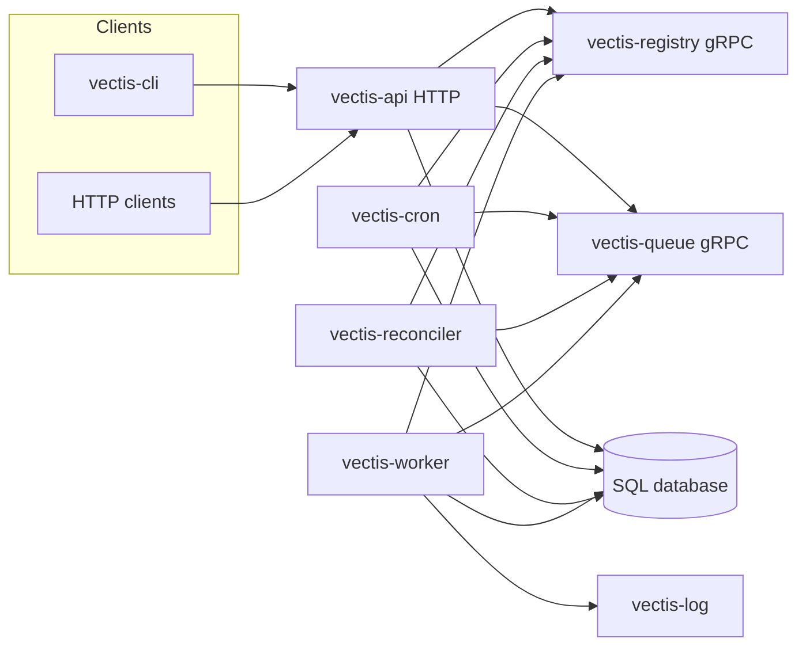

# Architecture (as built)

This document describes **what is implemented in the repository today**: processes, protocols, persistence, and how work moves through the system. **Project goals, design intent, and deploy posture** are in [PLANNING.md](PLANNING.md) §1. **Roadmap, target design, and federation** belong in [PLANNING.md](PLANNING.md) (§4 onward) and [FEDERATION.md](FEDERATION.md). [PLANNING.md](PLANNING.md) §2 points here for **canonical shipped detail** and keeps only persistence notes and pointers elsewhere. **Operational failure behavior** is in [FAILURE_DOMAINS.md](FAILURE_DOMAINS.md). **Terminology** is in [GLOSSARY.md](GLOSSARY.md). **Security and trust boundaries** are in [SECURITY.md](SECURITY.md).

## System role

Vectis is a self-hosted **build/CI-style orchestrator**: clients define **jobs** (a tree of steps/actions), create **runs** of those jobs, and **workers** execute runs while **persisting state** in a shared database and **buffering dispatch** through a queue service.

## Operational spine

The **database** holds durable definitions, run state, schedules, and leases. The **queue** holds work handed from producers to workers. Most systemic behavior is understood through those two; see [FAILURE_DOMAINS.md](FAILURE_DOMAINS.md#operational-spine).

## Component diagram

## Processes and roles

| Process | Role |
| --- | --- |
| **vectis-registry** | Service discovery: queue and log register; consumers resolve addresses when not pinned in config. |
| **vectis-queue** | FIFO work queue: enqueue from API, cron, reconciler; dequeue to workers. Optional on-disk persistence (WAL/snapshot) for backlog and in-flight delivery metadata. |
| **vectis-api** | REST API for job definitions and runs; writes to the database; submits work to the queue; exposes HTTP including run-event streaming, **`/health/live`**, and **`/health/ready`** for orchestration. |
| **vectis-worker** | Pulls jobs from the queue; opens a log stream to the log service; executes the job graph (built-in and extensible actions); updates run state in the database. One job at a time per process. |
| **vectis-log** | Accepts log streams from workers; serves log output to consumers over a separate HTTP port. |
| **vectis-cron** | Reads schedules from the database; enqueues runs when due. |
| **vectis-reconciler** | Periodically finds runs that are queued in the database but need another queue submission (e.g. after a partial failure path); enqueues them. |
| **vectis-local** | Single entrypoint that starts registry, queue, log, worker, cron, reconciler, and API together for local development. |

## Protocols and default ports

Default listen addresses are defined in [`internal/config/defaults.toml`](../internal/config/defaults.toml). Typical defaults:

| Surface | Port | Notes |
| --- | --- | --- |
| API HTTP | 8080 | REST and run-event stream endpoint |
| Queue gRPC | 8081 | Producers enqueue; workers dequeue/ack |
| Registry gRPC | 8082 | Registration and resolution |
| Log gRPC | 8083 | Worker log ingest |
| Log HTTP | 8084 | Log streaming to consumers |

**gRPC contracts** live under `api/proto/` (generated Go in `api/gen/go/`). **REST** is documented in the table below; there is no OpenAPI artifact in-tree today.

## Service discovery

- Components may **register** with the registry (configurable per queue/log).
- Consumers (API, worker, cron, reconciler) may resolve queue (and worker: queue + log) via the registry **or** use **pinned addresses** from configuration/environment so the registry is not required for those paths.

## Primary data flows

1. **Stored job trigger (API):** Client calls HTTP → API persists a new run in the database → API submits the job payload to the queue (asynchronous handoff with retries). HTTP can return success before the queue has accepted work; the reconciler covers gaps.
2. **Ephemeral run (API):** Client posts a job body → API persists definition/run records as needed → same queue handoff pattern as above.
3. **Scheduled run (cron):** Cron reads due schedules from the database → enqueues work like the API.
4. **Recovery (reconciler):** Reconciler queries for runs stuck in a queued state long enough → loads job definition from stored job or definition table → enqueues.
5. **Execution (worker):** Worker blocks on dequeue → claims the run in the database → acknowledges queue delivery → runs steps while streaming logs → updates run completion in the database.

## Persistence

| Store | Responsibility |
| --- | --- |
| **SQL database** | Job definitions, run rows (status, dispatch metadata, leases), cron schedules. Migrations are embedded; **SQLite** and **PostgreSQL** are supported via driver and DSN configuration. |
| **Queue persistence** | Optional directory on the queue host for WAL/snapshot of queued and in-flight items. If disabled, queue contents are memory-only and a restart can drop buffered work (database + reconciler still reflect intent). |

Details and roadmap notes: [PLANNING.md](PLANNING.md) §2.5.

## Job shape and actions

- Canonical message shape: `Job` in `api/proto/common.proto` (`id`, `run_id`, `root` node tree with `uses`, `with`, nested `steps`).
- Runtime jobs are typically **JSON** matching that shape over REST.
- Built-in actions include **shell**, **checkout**, and **sequence** (see `internal/action/builtins/`).

## REST surface (shipped)

| Method | Path | Purpose |
| --- | --- | --- |
| GET | `/health/live` | Liveness (process serving HTTP) |
| GET | `/health/ready` | Readiness (DB + managing queue gRPC **READY** when applicable) |
| GET | `/api/v1/jobs` | List job definitions |
| POST | `/api/v1/jobs` | Create job |
| GET | `/api/v1/jobs/{id}` | Get job definition |
| PUT | `/api/v1/jobs/{id}` | Update job definition |
| DELETE | `/api/v1/jobs/{id}` | Delete job |
| POST | `/api/v1/jobs/run` | Run from inline body (ephemeral) |
| POST | `/api/v1/jobs/trigger/{id}` | New run from stored definition |
| GET | `/api/v1/jobs/{id}/runs` | List runs |
| GET | `/api/v1/sse/jobs/{id}/runs` | Run events stream |

There is **no** authentication, projects API, artifact API, or HTTP cancel endpoint in the current mux.

## Configuration

Environment-driven configuration uses **`VECTIS_*`** prefixes per binary; nested keys follow the project’s viper conventions. See [CONFIGURATION.md](CONFIGURATION.md) for env names, flags, discovery, and data paths; [README.md](../README.md) for quick-start notes; [`internal/config/defaults.toml`](../internal/config/defaults.toml) for compiled-in defaults.

## Related documentation

| Topic | Document |
| --- | --- |
| Goals (§1), roadmap, naming, target vs shipped | [PLANNING.md](PLANNING.md) |
| Outages and expectations | [FAILURE_DOMAINS.md](FAILURE_DOMAINS.md) |
| Deferred multi-site design | [FEDERATION.md](FEDERATION.md) |
| Configuration (env, flags, discovery) | [CONFIGURATION.md](CONFIGURATION.md) |
| Glossary | [GLOSSARY.md](GLOSSARY.md) |
| Architecture Decision Records | [adr/README.md](adr/README.md) |
| Security posture | [SECURITY.md](SECURITY.md) |
| Contributing and dev workflow | [CONTRIBUTING.md](../CONTRIBUTING.md) |
