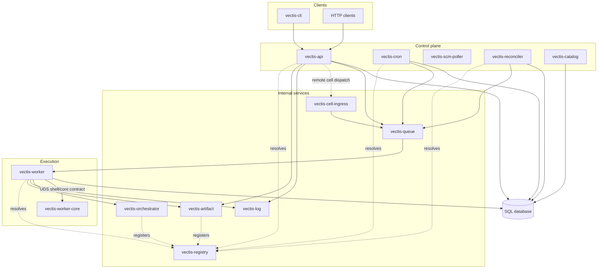

# Architecture

Vectis is a self-hosted build and CI orchestrator. Clients define jobs, Vectis creates runs of those jobs, and workers execute those runs while the system records state, streams logs, and repairs missed queue handoffs.

This page describes the architecture that exists today. Roadmap and target design live in [Planning](../developing/roadmap/planning.md).

## Mental Model

The two most important stores are the database and the queue:

| Store | What it means |
| --- | --- |
| SQL database | The durable source of truth for job definitions, runs, schedules, leases, dispatch events, cell catalog events, users, tokens, namespaces, and audit records. Global services and cell-local execution services can use distinct DSNs. |
| Queue | The handoff point between producers and workers. It tells workers what to pick up next. |

The database says what should exist and what state it is in. The queue helps move work to workers. When those disagree, the reconciler uses the database to submit missing queued work again.

## What Happens When A Run Starts

A typical source-backed reusable job trigger looks like this:

1. A client calls `vectis-api`.
2. The API creates a run row in the database.
3. The API returns `202 Accepted` once the run is recorded.
4. The API submits the run to `vectis-queue`.
5. A worker dequeues the run.
6. The worker loads the run into `vectis-orchestrator` and claims the task execution through the orchestrator.
7. The worker executes the selected task and streams logs to `vectis-log`.
8. The worker completes the task through `vectis-orchestrator`.
9. The worker records catalog events for run and task status visibility.
10. `vectis-catalog` applies catalog events to the global run catalog.
11. Clients inspect run status through the API and stream logs through the API.

The queue handoff can happen after the HTTP response. If the API records the run but misses the queue handoff, `vectis-reconciler` finds the queued run later and enqueues it again.

Ephemeral runs follow the same execution path, except the job definition is submitted inline instead of being resolved from a source repository.

In a split global/cell deployment, steps 5 through 9 happen against the cell-local database and queue. `vectis-catalog` can backfill missing cell catalog events from observed cell-local state, fan in pending catalog events from configured cell databases, then apply them to the global database.

## Component Diagram

## Components

| Component | Role |
| --- | --- |
| `vectis-api` | User-facing HTTP API. Stores jobs and runs, accepts triggers, exposes health, authenticated operational surfaces, run status, run events, and log streams. |
| `vectis-cell-ingress` | Private cell-local HTTP endpoint that durably accepts execution envelopes for this cell, enqueues them to the local queue, and repairs missed local queue handoffs. The global API can route non-local target cells to configured ingress endpoints. |
| `vectis-queue` | Internal FIFO queue shard. Producers enqueue work; workers dequeue and acknowledge deliveries. Queue persistence can preserve backlog and in-flight delivery metadata per shard. |
| `vectis-orchestrator` | Hot-state service for lease-fenced task execution claims and in-memory task choreography. Workers use it for the normal task execution path. |
| `vectis-worker` | Executes one task delivery at a time. Dequeues work, claims and completes task executions through the orchestrator, owns leases, cancellation intent, log/artifact callbacks, finalization, child task continuations, and cell catalog events. It delegates the action execution step to `vectis-worker-core` over a local Unix-domain socket. |
| `vectis-worker-core` | Worker execution core. It executes claimed tasks behind the worker shell/core boundary and reports task outcomes back to `vectis-worker`. The built-in core supports host execution and the configured local VM backend; external cores can provide other execution runtimes while preserving Vectis worker semantics. |
| `vectis-secrets` | Cell-local secret broker. Authenticates execution callers with SPIFFE-bearing mTLS, validates active execution claims, enforces secret access policy, and resolves configured secret references for workers. |
| `vectis-log` | Receives log chunks from workers and stores run logs. The API reads from it when clients stream logs. |
| `vectis-artifact` | Internal content-addressed blob service. It stores blobs by digest while the API exposes run-scoped artifact listing, metadata, and downloads. |
| `vectis-registry` | Internal service discovery for queue, orchestrator, log, artifact, and worker-control addresses when clients do not use pinned addresses. |
| `vectis-cron` | Reads schedules from the database and enqueues due runs. |
| `vectis-scm-poller` | Claims due SCM poll triggers, records deduplicated provider events, creates one run per event, and dispatches it through cell ingress. |
| `vectis-reconciler` | Finds queued runs that need another queue handoff and enqueues them again. |
| `vectis-catalog` | Backfills missing status events from observed state, drains global catalog events, optionally fans in pending events from configured cell databases, and applies them to the global run catalog. |
| `vectis-ui` | Serves the embedded browser UI, manages browser sessions as a backend-for-frontend, and proxies browser API calls to `vectis-api`. |
| `vectis-docs` | Serves the embedded docs site as static HTTP. |
| `vectis-local` | Development supervisor that starts the local registry, queue, orchestrator, log, artifact, worker-core, secrets, cell ingress, worker, cron, reconciler, catalog, API, UI, and docs together. |
| `vectis-cli` | User and operator command-line client for the HTTP API. |

## Producers And Workers

Five components can produce work today:

- `vectis-api`, when a client submits or triggers a job
- `vectis-cell-ingress`, when `vectis-api` hands this cell an execution envelope or a durable accepted execution needs local queue repair
- `vectis-cron`, when a schedule is due
- `vectis-reconciler`, when a recorded run still needs queue handoff
- `vectis-worker`, when task fan-out produces a continuation execution

`vectis-scm-poller` is part of the trigger family. It records provider events into the database, links each new stable event key to one durable run, and dispatches that run through the shared trigger dispatch path.

Workers are the execution side. Each `vectis-worker` process handles one task delivery at a time. Task execution claims and leases live in `vectis-orchestrator`, so the orchestrator fences duplicate queue deliveries while the database remains the durable catalog and repair surface.

### Task-Mode Choreography

Task-mode execution is orchestrator-choreographed by default. The worker loads the run graph into `vectis-orchestrator`, claims one execution, and asks the orchestrator to complete that execution after the action finishes.

The orchestrator keeps the hot run graph in memory for the normal path. Durable task rows remain the recovery source: when a worker finds that the orchestrator is missing a run after restart, it reloads the graph with task status snapshots and reclaims the active execution before continuing.

The worker that completes a task owns the event-path decisions for that completion:

1. It completes the task execution through the orchestrator.
2. Successful task completion may activate planned child task executions in the orchestrator.
3. The worker directly enqueues activated child executions to the local queue with execution envelopes.
4. If there is no immediate continuation, the task reduce service summarizes task state. Terminal failure dominates incomplete siblings; all-succeeded reduces to run success; incomplete work leaves the run available for later continuation.
5. The task finalization boundary records the finalization outcome before the worker records status catalog events.

The reconciler remains a repair loop for durable queued work. It is not the normal event path for task fan-out or fan-in.

## Logs

Workers do not send job output directly to API clients. The log path is:

1. Worker sends log chunks to `vectis-log` over gRPC.
2. `vectis-log` stores the run log.
3. `vectis-api` exposes the run log as Server-Sent Events.
4. `vectis-cli` or another client consumes the API stream.

For user-facing behavior and reconnect controls, see [Log Streaming](../using/log-streaming.md).

## Persistence

| Store | Responsibility |
| --- | --- |
| SQL database | Job definitions, ephemeral definitions, runs, run leases, dispatch events, cell execution acceptances, cell catalog events, cron schedules, users, tokens, namespaces, role bindings, audit rows, and idempotency keys. |
| Queue persistence | Optional queue-host storage for queued and in-flight items. If disabled, queue contents are memory-only. |
| Log storage | Run log files owned by `vectis-log`. Preserve this storage if run logs must survive restarts. |
| Artifact storage | Content-addressed blobs owned by `vectis-artifact`. Preserve this storage when artifact data must survive restarts. |

SQLite and PostgreSQL are supported. SQLite is the default for local development and simple single-node use. PostgreSQL is the production-oriented path for multi-service deployments. Configuration details are in [Configuration](../operating/configuration.md).

## Service Discovery

Queue, orchestrator, log, and artifact addresses can be found in two ways:

| Mode | How it works | When to use it |
| --- | --- | --- |
| Registry discovery | Queue, orchestrator, log, and artifact services register with `vectis-registry`; clients resolve addresses through the registry as needed. | Convenient local or simple deployments where registry availability is acceptable. |
| Pinned addresses | Components are configured with explicit queue, orchestrator, log, or artifact addresses. | Deployments that want fewer startup dependencies or already have external service discovery. |

See [Configuration](../operating/configuration.md#service-discovery-vs-fixed-addresses) for the relevant settings.

## Protocols And Ports

Vectis has two communication layers:

- HTTP at the edge, used by `vectis-cli`, API clients, health checks, metrics scrapes, and SSE streams.
- gRPC between Vectis services, used for queue operations, registry discovery, orchestrator choreography, log movement, and artifact blob upload/read.

The common local defaults are:

| Surface | Default port | Notes |
| --- | --- | --- |
| API HTTP | `8080` | REST API, health, API metrics, run events, and log SSE. |
| Queue gRPC | `8081` | Producers enqueue; workers dequeue and acknowledge. |
| Registry gRPC | `8082` | Service registration and resolution. |
| Log gRPC | `8083` | Worker log ingest and API log reads. |
| Cell ingress HTTP | `8085` | Private execution submission endpoint for a cell. |
| Artifact gRPC | `8086` | Internal artifact blob upload, stat, and read. |
| Orchestrator gRPC | `8087` | Worker claim, lease, and task choreography path. |
| Log HTTP | `8084` | Log-service HTTP surface; user-facing log streaming goes through the API. |
| Docs HTTP | `8088` | Static documentation site. |
| Secrets gRPC | `8090` | Cell-local secret resolution for workers. |

Prometheus metrics are exposed on `/metrics`. The API serves metrics on its main HTTP listener; queue, orchestrator, worker, log, artifact, log-forwarder, secrets, reconciler, catalog, and cell ingress use dedicated metrics listeners by default. Workers publish lifecycle gauges for drain, execution/finalization phase, and observed database unavailability.

For exact ports, environment variables, TLS settings, and discovery settings, see [Configuration](../operating/configuration.md). For the REST route table, see [API Reference](../using/api-reference.md). gRPC contracts live under `api/proto/`.

## Jobs And Actions

Jobs are trees of nodes. Each node has:

- `id`, a node identifier unique within the job
- `uses`, the action to run
- `with`, action inputs
- `steps`, child nodes
- `isolation`, an optional `host` or `vm` execution request

Built-in actions include process actions such as `builtins/script`, `builtins/test`, `builtins/checkout`, and `builtins/upload-artifact`; control-flow actions such as `builtins/sequence`, `builtins/parallel`, `builtins/if`, `builtins/retry`, `builtins/timeout`, `builtins/finally`, and `builtins/fallback`; and the `builtins/result` summary action. Standard integrations such as `gerrit/review@v1` are action extensions resolved through configured action registry roots. Job shape and validation are covered in [Your First Job](../using/your-first-job.md) and [Job Definition Validation](../using/job-validation.md). Contributor guidance for adding actions is in [Adding Actions](../developing/actions.md).

## Worker Execution Environment

By default, the worker and worker core are deployed together on the same host or in the same pod. The worker creates shell-owned task sessions and the core executes the claimed task through the local Unix-domain socket contract. Logs and artifacts flow back through worker-owned shell callbacks, so the worker remains responsible for durable log/artifact routing and final run state.

The built-in worker core creates a per-run workspace directory and executes built-in actions as child processes on the core host. The workspace is useful operational isolation: checkout and script steps share a predictable directory, and the executor can clean it up when the run finishes.

That workspace is not a security sandbox. Host execution still shares the worker user's permissions, host kernel, process environment, network access, and mounted credentials. The accepted target design for stronger containment is [ADR 0009](../developing/architecture-decisions/0009-worker-execution-containment-providers.md): keep host execution as the default compatibility path, then add container and VM execution providers behind a worker runner boundary.

`vectis-worker` can also be configured with the `lima` execution backend, which registers an operator-managed Lima VM as the provider for nodes that inherit or request `isolation: "vm"`. This is the first VM-oriented command backend; full placement awareness, disposable VM lifecycle, and container providers remain future work.

## What Is Not In This Architecture

Vectis does not currently ship:

- a projects API
- a public artifact upload API
- profile-aware scheduling for mixed host, container, or disposable VM worker pools
- shared-storage active/active queue or log clustering
- multi-site federation

Those may appear in roadmap docs, but they are not part of the shipped architecture described here.

## Related Docs

| Need | Read |
| --- | --- |
| Terms such as run, job, node, claim, and delivery | [Glossary](./glossary.md) |
| Security and trust boundaries | [Security](./security.md) |
| Failure behavior and recovery expectations | [Failure Domains](./failure-domains.md) |
| API routes and response behavior | [API Reference](../using/api-reference.md) |
| Configuration, ports, TLS, and discovery | [Configuration](../operating/configuration.md) |
| Scaling and restart posture | [Scaling And Restarts](../operating/deployment/scaling-and-restarts.md) |
| Current roadmap and target design | [Planning](../developing/roadmap/planning.md) |
| Architecture decisions | [Architecture Decisions](../developing/architecture-decisions/index.md) |
