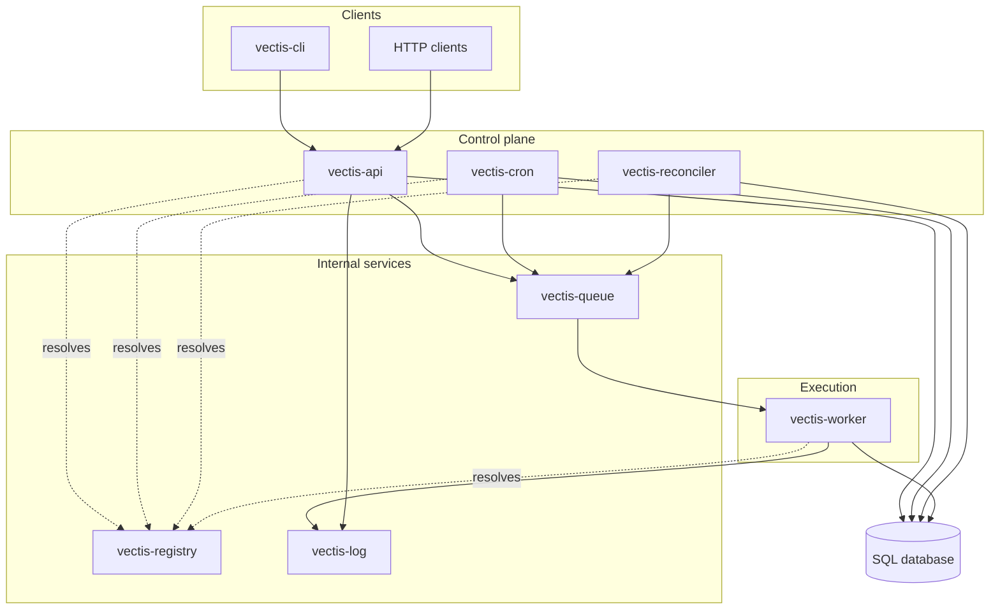

# Architecture

Vectis is a self-hosted build and CI orchestrator. Clients define jobs, Vectis creates runs of those jobs, and workers execute those runs while the system records state, streams logs, and repairs missed queue handoffs.

This page describes the architecture that exists today. Roadmap and target design live in [Planning](../developing/roadmap/planning.md) and [Federation](../developing/roadmap/federation.md).

## Mental Model

The two most important stores are the database and the queue:

| Store | What it means |
| --- | --- |
| SQL database | The durable source of truth for job definitions, runs, schedules, leases, dispatch events, users, tokens, namespaces, and audit records. |
| Queue | The handoff point between producers and workers. It tells workers what to pick up next. |

The database says what should exist and what state it is in. The queue helps move work to workers. When those disagree, the reconciler uses the database to submit missing queued work again.

## What Happens When A Run Starts

A typical stored-job trigger looks like this:

1. A client calls `vectis-api`.
2. The API creates a run row in the database.
3. The API returns `202 Accepted` once the run is recorded.
4. The API submits the run to `vectis-queue`.
5. A worker dequeues the run.
6. The worker claims the run in the database.
7. The worker executes the job tree and streams logs to `vectis-log`.
8. The worker updates the final run status in the database.
9. Clients inspect run status through the API and stream logs through the API.

The queue handoff can happen after the HTTP response. If the API records the run but misses the queue handoff, `vectis-reconciler` finds the queued run later and enqueues it again.

Ephemeral runs follow the same execution path, except the job definition is submitted inline instead of being looked up from a stored job.

## Component Diagram

## Components

| Component | Role |
| --- | --- |
| `vectis-api` | Public HTTP API. Stores jobs and runs, accepts triggers, exposes health, metrics, run status, run events, and log streams. |
| `vectis-queue` | Internal FIFO queue. Producers enqueue work; workers dequeue and acknowledge deliveries. Queue persistence can preserve backlog and in-flight delivery metadata. |
| `vectis-worker` | Executes one run at a time. Dequeues work, claims the run in the database, executes actions, streams logs, and writes final status. |
| `vectis-log` | Receives log chunks from workers and stores run logs. The API reads from it when clients stream logs. |
| `vectis-registry` | Internal service discovery for queue and log addresses when clients do not use pinned addresses. |
| `vectis-cron` | Reads schedules from the database and enqueues due runs. |
| `vectis-reconciler` | Finds queued runs that need another queue handoff and enqueues them again. |
| `vectis-local` | Development supervisor that starts the local registry, queue, log, worker, cron, reconciler, and API together. |
| `vectis-cli` | User and operator command-line client for the HTTP API. |

## Producers And Workers

Three components can produce work:

- `vectis-api`, when a client submits or triggers a job
- `vectis-cron`, when a schedule is due
- `vectis-reconciler`, when a recorded run still needs queue handoff

Workers are the execution side. Each `vectis-worker` process handles one run at a time. Run claims and leases live in the database, so the database is what prevents two workers from owning the same persisted run at the same time.

## Logs

Workers do not send job output directly to API clients. The log path is:

1. Worker sends log chunks to `vectis-log` over gRPC.
2. `vectis-log` stores the run log.
3. `vectis-api` exposes the run log as Server-Sent Events.
4. `vectis-cli` or another client consumes the API stream.

For user-facing behavior and reconnect controls, see [Log Streaming](../using/log-streaming.md).

## Persistence

| Store | Responsibility |
| --- | --- |
| SQL database | Job definitions, ephemeral definitions, runs, run leases, dispatch events, cron schedules, users, tokens, namespaces, role bindings, audit rows, and idempotency keys. |
| Queue persistence | Optional queue-host storage for queued and in-flight items. If disabled, queue contents are memory-only. |
| Log storage | Run log files owned by `vectis-log`. Preserve this storage if run logs must survive restarts. |

SQLite and PostgreSQL are supported. SQLite is the default for local development and simple single-node use. PostgreSQL is the production-oriented path for multi-service deployments. Configuration details are in [Configuration](../operating/configuration.md).

## Service Discovery

Queue and log addresses can be found in two ways:

| Mode | How it works | When to use it |
| --- | --- | --- |
| Registry discovery | Queue and log register with `vectis-registry`; API, workers, cron, and reconciler resolve addresses through the registry. | Convenient local or simple deployments where registry availability is acceptable. |
| Pinned addresses | Components are configured with explicit queue and log addresses. | Deployments that want fewer startup dependencies or already have external service discovery. |

See [Configuration](../operating/configuration.md#service-discovery-vs-fixed-addresses) for the relevant settings.

## Protocols And Ports

Vectis has two communication layers:

- HTTP at the edge, used by `vectis-cli`, API clients, health checks, metrics scrapes, and SSE streams.
- gRPC between Vectis services, used for queue operations, registry discovery, and log movement.

The common local defaults are:

| Surface | Default port | Notes |
| --- | --- | --- |
| API HTTP | `8080` | REST API, health, API metrics, run events, and log SSE. |
| Queue gRPC | `8081` | Producers enqueue; workers dequeue and acknowledge. |
| Registry gRPC | `8082` | Service registration and resolution. |
| Log gRPC | `8083` | Worker log ingest and API log reads. |
| Log HTTP | `8084` | Log-service HTTP surface; user-facing log streaming goes through the API. |

Prometheus metrics are exposed on `/metrics`. The API serves metrics on its main HTTP listener; queue, worker, log, and reconciler use dedicated metrics listeners by default.

For exact ports, environment variables, TLS settings, and discovery settings, see [Configuration](../operating/configuration.md). For the REST route table, see [API Reference](../using/api-reference.md). gRPC contracts live under `api/proto/`.

## Jobs And Actions

Jobs are trees of nodes. Each node has:

- `id`, a node identifier unique within the job
- `uses`, the action to run
- `with`, action inputs
- `steps`, child nodes

Built-in actions currently include `builtins/shell`, `builtins/checkout`, and `builtins/sequence`. Job shape and validation are covered in [Your First Job](../using/your-first-job.md) and [Job Definition Validation](../using/job-validation.md). Contributor guidance for adding actions is in [Adding Actions](../developing/actions.md).

## What Is Not In This Architecture

Vectis does not currently ship:

- a projects API
- an artifacts API
- active/active queue or log clustering
- multi-site federation
- an OpenAPI artifact

Those may appear in roadmap docs, but they are not part of the shipped architecture described here.

## Related Docs

| Need | Read |
| --- | --- |
| Terms such as run, job, node, claim, and delivery | [Glossary](./glossary.md) |
| Security and trust boundaries | [Security](./security.md) |
| Failure behavior and recovery expectations | [Failure Domains](./failure-domains.md) |
| API routes and response behavior | [API Reference](../using/api-reference.md) |
| Configuration, ports, TLS, and discovery | [Configuration](../operating/configuration.md) |
| Scaling and restart posture | [Scaling And Restarts](../operating/deployment/scaling-and-restarts.md) |
| Current roadmap and target design | [Planning](../developing/roadmap/planning.md) |
| Architecture decisions | [Architecture Decisions](../developing/architecture-decisions/index.md) |
