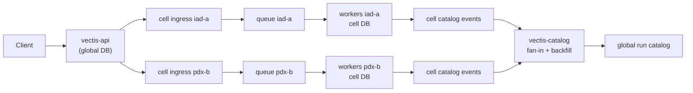

# Multi-Cell Operation

Multi-cell Vectis lets one global control plane dispatch work into multiple execution cells. A cell is a mostly independent execution target: it has its own queue, cell ingress, workers, and cell-local database. The global stack stores jobs, schedules, run catalog state, and dispatch history.

Use this guide when you want a run to execute in a named location such as `iad-a`, `pdx-b`, or `sjc-c`, or when you are using `vectis-local --cell` to test that shape locally.

For the configuration reference, see [Configuration](./configuration.md). For run handoff troubleshooting, see [Dispatch Handoff Visibility](./reliability/dispatch-visibility.md).

## Deployment Shape

| Layer | Binaries | Database role | Main responsibility |
| --- | --- | --- | --- |
| Global control plane | `vectis-api`, `vectis-cron`, `vectis-reconciler`, `vectis-catalog` | Global DB | Store jobs and global run catalog, accept user/API triggers, repair missed dispatch, fan in cell events. |
| Execution cell | `vectis-cell-ingress`, `vectis-queue`, `vectis-worker` | Cell DB | Accept routed executions, queue them locally, execute work, record local status events. |
| Shared support | `vectis-registry`, `vectis-log`, `vectis-docs` | Depends on service | Discovery, log ingest/streaming, documentation. |

The single-cell deployment is the degenerate case: global and cell services can share one database and one queue. In multi-cell mode, prefer split global and cell databases so cell-local execution does not write through the global database on every status transition.

## Production Stack Wiring

Run one global control plane and one independently scaled stack per cell:

```sh
# global control plane
VECTIS_GLOBAL_DATABASE_DSN=postgres://vectis-global/...
VECTIS_CELL_INGRESS_ENDPOINTS=local=http://local-cell-ingress:8085,iad-a=http://iad-cell-ingress:8085,pdx-b=http://pdx-cell-ingress:8085
VECTIS_CATALOG_CELL_DATABASE_DSNS=local=postgres://vectis-cell-local/...,iad-a=postgres://vectis-cell-iad/...,pdx-b=postgres://vectis-cell-pdx/...

# each execution cell
VECTIS_CELL_ID=iad-a
VECTIS_CELL_DATABASE_DSN=postgres://vectis-cell-iad/...
VECTIS_CELL_INGRESS_QUEUE_ADDRESS=iad-queue:9090
VECTIS_WORKER_QUEUE_ADDRESS=iad-queue:9090
```

Start `vectis-api`, `vectis-cron`, `vectis-reconciler`, and `vectis-catalog` against the global database. Start `vectis-cell-ingress`, `vectis-queue`, and `vectis-worker` in each cell against that cell's database and queue. If a deployment keeps the default `local` cell, give it the same treatment as every other cell once global and cell databases are split.

## Request Flow

1. A client triggers a stored job with `cell_id` or `cell_ids`.
2. `vectis-api` creates one global run row per target cell and records the owning cell.
3. `vectis-api` routes each execution to the target cell's private `vectis-cell-ingress` endpoint.
4. Cell ingress durably accepts the execution in the cell DB, then hands it to the cell-local queue.
5. A worker in that cell claims the run, executes it, and records status events in the cell-local catalog inbox.
6. `vectis-catalog` fans cell events into the global DB, backfills missing status events when needed, and applies them to the global run catalog.



## Required Routing Configuration

Every global producer that can dispatch work needs the same cell ingress map. Configure either the shared setting or the role-specific setting:

```sh
VECTIS_CELL_INGRESS_ENDPOINTS=iad-a=http://iad.example:8085,pdx-b=http://pdx.example:8085
```

Role-specific examples:

```sh
VECTIS_API_SERVER_CELL_INGRESS_ENDPOINTS=iad-a=http://iad.example:8085,pdx-b=http://pdx.example:8085
VECTIS_RECONCILER_CELL_INGRESS_ENDPOINTS=iad-a=http://iad.example:8085,pdx-b=http://pdx.example:8085
VECTIS_CRON_CELL_INGRESS_ENDPOINTS=iad-a=http://iad.example:8085,pdx-b=http://pdx.example:8085
```

Use the same cell IDs that clients pass as `cell_id` or `cell_ids`. If global and cell databases are split, configure an ingress endpoint for every execution target, including the local/default cell. Direct queue fallback is disabled when Vectis detects split global and cell databases.

Cell ingress is private infrastructure, not a public API. Expose it only to global producers that are allowed to submit executions to that cell.

## Cell Ingress Security

`vectis-cell-ingress` exposes the internal execution submission route `POST /cell/v1/executions`, plus health and metrics endpoints. Execution submissions must use `application/json` and are capped at 2 MiB; health and metrics reads do not accept request bodies. Host validation accepts the bind host, loopback, and the local cell's Host from the shared static ingress endpoint map; set `VECTIS_CELL_INGRESS_ALLOWED_HOSTS` when the cell process does not read that map. It is intentionally slim: user authentication, RBAC, namespace checks, and trigger authorization happen at the global API before dispatch. Cell ingress trusts that only approved global producers can reach it.

For production-like deployments:

- bind cell ingress on a private interface or behind an internal load balancer
- restrict network reachability to global producers such as API, cron, and reconciler
- use firewall rules, service mesh policy, or platform network policy to block user and internet traffic
- put cell ingress behind HTTPS or mTLS-capable infrastructure when traffic crosses an untrusted network
- keep the cell queue and cell database reachable only by services in that cell
- scrape cell ingress health and metrics from a trusted monitoring network only

The global API never returns private ingress URLs from `GET /api/v1/cells/status`; it reports readiness, queued/root-dispatch counts, pending task continuation counts, and catalog counts only.

## Required Catalog Configuration

When cell workers write to cell-local databases, global run listings do not update until `vectis-catalog` drains those cell databases:

```sh
VECTIS_CATALOG_CELL_DATABASE_DSNS=iad-a=/var/lib/vectis/cells/iad-a/db.sqlite3,pdx-b=/var/lib/vectis/cells/pdx-b/db.sqlite3
```

Equivalent flags:

```sh
vectis-catalog \
  --cell-database-dsn iad-a=/var/lib/vectis/cells/iad-a/db.sqlite3 \
  --cell-database-dsn pdx-b=/var/lib/vectis/cells/pdx-b/db.sqlite3
```

The catalog service reads pending cell events, copies them into the global catalog inbox, and applies them idempotently. Before copying each source, it also backfills missing run and execution status events from observed cell DB state. That covers the narrow failure where a worker committed a state transition but missed the matching catalog event write.

## Dispatch Repair

The API returns `202 Accepted` after the global run row is created. Execution handoff happens after that. If the target cell route is missing, cell ingress is down, or the API exits during handoff, the run remains queued in the global DB and dispatch events record the failure.

`vectis-reconciler` is the repair loop. It scans queued runs whose dispatch timestamp is missing or old, attaches the original execution envelope, and submits the run through the same cell ingress routing map. When the cell becomes reachable, the reconciler records a later `reconciler` dispatch success event and the worker can execute normally.

Use:

```sh
vectis-cli runs show <run-id>
```

Look for `dispatch_events`:

| Pattern | Meaning |
| --- | --- |
| `api` `attempt`, then `api` `failure` | Initial dispatch failed after the run was created. |
| Later `reconciler` `attempt`, then `reconciler` `success` | Automatic repair delivered the run to a cell ingress. |
| Repeated `reconciler` `failure` | The route, ingress endpoint, or cell queue is still unhealthy. |

Scrape API and reconciler metrics to see dispatch health across cells:

| Metric | Labels | Meaning |
| --- | --- | --- |
| `vectis_run_dispatch_events_total` | `source`, `event_type`, `target_cell` | Dispatch attempts, failures, and successes recorded by API or reconciler for each target cell. |

Use `source="api"` failures to find initial dispatch problems. Use `source="reconciler"` failures to find automatic repair attempts that still cannot reach a cell. A later `source="reconciler", event_type="success"` for the same target cell means the repair loop is catching up.

The global API also exposes configured ingress readiness:

```sh
./bin/vectis-cli cells status
```

This reports cell IDs, ingress route readiness, queued/stuck run counts, and catalog inbox counts without returning the private ingress URLs. Use `--format json` when automation needs the raw response. Cells are included when they have a configured ingress route or when the global run/catalog state already references them. `vectis-cli doctor` uses the same endpoint for the `cells.ingress` check, so work targeting a cell with no route shows up as `missing_route`.

## Running Locally

`vectis-local` can start additional local cells with repeated `--cell` flags:

```sh
./bin/vectis-local --cell pdx-b --cell sjc-c
```

This starts one global stack plus a queue, cell ingress, worker, and cell-local SQLite database for each cell. It also wires `VECTIS_CELL_INGRESS_ENDPOINTS` and `VECTIS_CATALOG_CELL_DATABASE_DSNS` for the child processes.

Trigger one job across cells:

```sh
./bin/vectis-cli jobs trigger example-job --cell local --cell pdx-b --cell sjc-c
```

Run a one-off job file in one cell:

```sh
./bin/vectis-cli jobs run examples/sequenced.json --cell pdx-b
```

Replay a completed run into its original cell, or override the target cell explicitly:

```sh
./bin/vectis-cli runs replay <run-id>
./bin/vectis-cli runs replay <run-id> --cell pdx-b
```

Replay creates a new run ID. It does not take over the source run. The new run uses the source run's captured definition version and records `replay_of_run_id`, so operators can reproduce what originally ran even if the stored job has changed since then.

Then list the global run catalog:

```sh
./bin/vectis-cli runs list example-job
```

The output includes the owning cell for each run. To focus on one cell:

```sh
./bin/vectis-cli runs list example-job --cell pdx-b
```

## Operator Checklist

Before enabling multi-cell routing outside local development:

| Check | Why it matters |
| --- | --- |
| Stable cell IDs are chosen | Cell IDs appear in API requests, run catalog rows, dispatch events, and catalog source config. |
| API, cron, and reconciler share the same ingress map | A run created by one producer must be repairable by the reconciler. |
| Every cell runs cell ingress, queue, and workers | Ingress only accepts work; queue and workers execute it. |
| Cell ingress Host validation matches the static route map | Each cell accepts the Host used by producers for that cell's endpoint. |
| Cell ingress can reach its local queue | Ingress durably accepts before local queue handoff, then repairs missed local queue handoff. |
| `vectis-catalog` can read every cell DB | Global run status depends on fan-in from cell-local event inboxes. |
| `vectis-cli doctor` is clean | The doctor checks catalog backlog, stuck runs, queue backlog, and core API reachability. |
| Cell ingress endpoints are private | Cell ingress is an internal execution submission surface. |

## Fan-In Metrics

Scrape `vectis-catalog` metrics to see which cell sources are contributing events or requiring backfill:

| Metric | Labels | Meaning |
| --- | --- | --- |
| `vectis_catalog_fanin_events_read_total` | `source_cell` | Pending catalog events read from a cell-local source DB. |
| `vectis_catalog_fanin_events_copied_total` | `source_cell` | Cell events copied into the global catalog inbox. |
| `vectis_catalog_fanin_events_backfilled_total` | `source_cell` | Missing cell events synthesized from observed cell DB state before copy. |

Persistent reads without applied global catalog progress point to the global inbox processor. Persistent backfill for one cell points to missed catalog event writes or local cell DB pressure. Repeated zero activity for a cell that should be running work usually means `vectis-catalog` cannot see that cell database or the cell has not emitted events.

`GET /api/v1/catalog/status` and `vectis-cli doctor` include per-source-cell inbox counts when the global inbox contains events. Use those counts to find the cell responsible for pending or failed catalog events before digging into `vectis-catalog` logs or cell-local DB pressure.

## Current Limits

Multi-cell support routes whole runs to cells and fans status back into the global catalog. It does not yet provide cross-cell DAG choreography inside one run, artifact replication between cells, per-cell action repository distribution, or cell-to-cell dispatch. Model cross-cell work as multiple runs for now, or keep dependent steps inside one cell.
