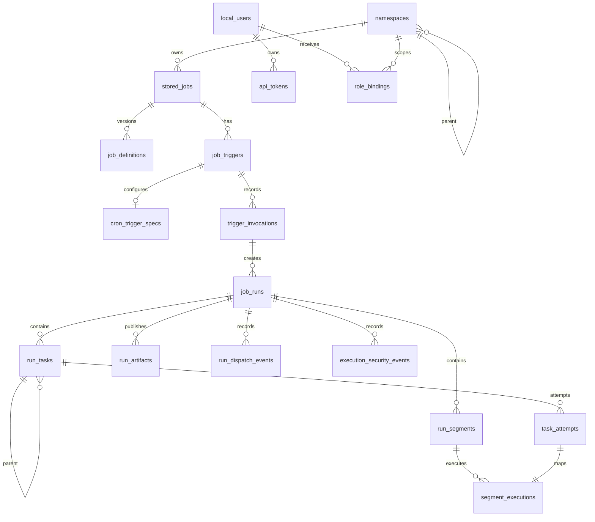

# Database Schema Reference

This page describes the SQL schema Vectis installs through the embedded migrations in `internal/migrations/`. It is for operators, support engineers, and maintainers who need to inspect storage during backup, restore, repair, retention, or incident response.

Treat the database as application-owned state. Prefer the API, CLI, or documented repair commands for routine work. Direct SQL reads are useful for diagnosis; direct SQL writes should be limited to tested repair procedures.

For lifecycle interpretation of run, task, execution, dispatch, and queue states, see the [Run, Task, And Queue State Reference](./run-state-reference.md).

## Scope And Conventions

The current schema is installed by migration `001_initial` for both SQLite and Postgres. The table set is the same for both drivers, with type differences where each database has different native types.

| Convention | Meaning |
| --- | --- |
| `id` | Database-local surrogate key. Do not expose it as a global identifier unless an API explicitly does so. |
| `global_id` | Stable cross-cell or API-facing identifier reserved for replication/catalog use. Some early records may have an empty value when read through older code paths. |
| `*_id` text fields | Domain identifiers, usually UUIDs or deterministic Vectis identifiers. |
| `*_at` timestamp fields | Wall-clock timestamps. SQLite uses `TIMESTAMP`; Postgres uses `TIMESTAMPTZ` unless noted below. |
| `*_unix_nano` fields | Unix time in nanoseconds. Used when precise expiry/refill calculations matter. |
| Other integer time fields | Unix seconds unless the field name says `unix_nano`. |
| Boolean fields | SQLite stores booleans as `INTEGER` `0`/`1`; Postgres stores native `BOOLEAN`. |

Notable driver differences:

| Area | SQLite | Postgres |
| --- | --- | --- |
| Integer primary keys | `INTEGER PRIMARY KEY AUTOINCREMENT` | `BIGSERIAL PRIMARY KEY` |
| Boolean columns | `INTEGER` | `BOOLEAN` |
| Timestamp columns | `TIMESTAMP` | `TIMESTAMPTZ` |
| `cron_trigger_specs.next_run_at` | `TIMESTAMP` | `TEXT` |
| `cron_schedule_fires.scheduled_for` | `TIMESTAMP` | `TEXT` |
| `audit_log.metadata` | `TEXT` | `JSONB` |
| `audit_log.ip_address` | `TEXT` | `INET` |

## Common Values

Run statuses in `job_runs.status`:

| Value | Meaning |
| --- | --- |
| `queued` | Accepted and waiting for dispatch or task continuation. |
| `running` | Claimed by execution machinery or actively receiving execution updates. |
| `succeeded` | Terminal success. |
| `failed` | Terminal failure. `failure_code` and `failure_reason` explain why when available. |
| `orphaned` | Vectis lost confidence in the active owner and needs reconciliation or repair. `orphan_reason` explains the class. |
| `cancelled` | Terminal cancellation requested by API or execution flow. |
| `abandoned` | Terminal operator repair state for work intentionally left unresolved. |
| `aborted` | Internal/catalog input that is normalized to cancellation for persisted runs. |

Task, attempt, segment, and execution statuses:

| Value | Meaning |
| --- | --- |
| `planned` | Described by a task plan but not yet dispatchable. |
| `pending` | Created and waiting for acceptance or dependency completion. |
| `accepted` | Accepted by the target cell or worker path. |
| `running` | Execution has started. |
| `succeeded` | Terminal success. |
| `failed` | Terminal failure. |
| `cancelled` | Terminal cancellation. |
| `aborted` | Terminal abort from execution machinery. |

Other common enumerations:

| Field | Values |
| --- | --- |
| `job_triggers.trigger_type`, `trigger_invocations.trigger_type` | `manual`, `cron`, `replay`, `webhook` |
| `job_runs.failure_code` | `execution_error`, `force_failed`, `dispatch_expired`, `invalid_execution_envelope`, or empty when not applicable |
| `job_runs.orphan_reason` | `lease_expired`, `ack_uncertain`, `worker_core_unknown`, or empty when not orphaned |
| `job_runs.cancel_reason` / some `failure_reason` values | `api_cancelled`, `manual_repair`, or a more specific message |
| `run_dispatch_events.source` | `api`, `cron`, `reconciler` |
| `run_dispatch_events.event_type` | `accepted`, `attempt`, `success`, `failure` |
| `cell_catalog_events.event_type` | `run.status`, `execution.status`, `artifact.record`, `execution.security` |
| `cell_catalog_events.status` | `pending`, `applied`, `failed` |
| `execution_security_events.event_type` | `svid_check`, `secret_resolution` |
| `role_bindings.role` | `viewer`, `trigger`, `operator`, `admin` |
| `api_token_scopes.action` | `job:read`, `job:write`, `run:trigger`, `run:read`, `run:operator`, `admin:*`, `user:admin`, `api:any` |

For role meanings, action scope, and token-scope behavior, see [Authorization Reference](./authorization-reference.md).

## Relationship Map

## Namespace And Authorization Tables

### `namespaces`

Stores the namespace tree used for job ownership and hierarchical RBAC.

| Field | Meaning |
| --- | --- |
| `id` | Local namespace key. Root namespace is inserted with `id=1`. |
| `global_id` | Stable namespace identifier. Root uses `namespace-root`. |
| `name` | Last path segment, or `root` for `/`. |
| `parent_id` | Parent namespace `id`; null for root. |
| `path` | Absolute namespace path such as `/` or `/teams/build`. |
| `break_inheritance` | Stops inherited role lookup from ancestors when true. |
| `home_cell` | Cell that owns the namespace's primary job/control records. Defaults to `local`. |
| `created_at` | Creation timestamp. |

Constraints and indexes: `id` primary key; `global_id` unique; `path` unique; `parent_id` references `namespaces(id)`.

### `local_users`

Stores local API users.

| Field | Meaning |
| --- | --- |
| `id` | Local user key. |
| `global_id` | Stable user identifier. |
| `username` | Unique login name. |
| `password_hash` | Bcrypt password hash. Treat as sensitive. |
| `enabled` | Whether the user may authenticate. Disabling a user revokes tokens and sessions through application logic. |
| `created_at` | Creation timestamp. |

Constraints and indexes: `id` primary key; `global_id` unique; `username` unique.

### `role_bindings`

Assigns namespace-scoped roles to local users.

| Field | Meaning |
| --- | --- |
| `id` | Local binding key. |
| `global_id` | Stable binding identifier. |
| `local_user_id` | User receiving the role. |
| `namespace_id` | Namespace where the role applies. |
| `role` | One of `viewer`, `trigger`, `operator`, `admin`. |
| `created_at` | Creation timestamp. |

Constraints and indexes: `local_user_id` references `local_users(id)` with cascade delete; `namespace_id` references `namespaces(id)` with cascade delete; unique `(local_user_id, namespace_id, role)`; indexes on `local_user_id` and `namespace_id`.

### `api_tokens`

Stores hashed API tokens.

| Field | Meaning |
| --- | --- |
| `id` | Local token key. |
| `global_id` | Stable token identifier. |
| `local_user_id` | User that owns the token. |
| `token_hash` | SHA-256 hash of the raw token. Treat as credential material. |
| `label` | Human label supplied at creation. |
| `expires_at` | Optional absolute expiry. |
| `created_at` | Creation timestamp. |
| `last_used_at` | Last successful token use timestamp. |

Constraints and indexes: `local_user_id` references `local_users(id)` with cascade delete; `token_hash` unique.

### `api_token_scopes`

Restricts an API token to a subset of authorization actions.

| Field | Meaning |
| --- | --- |
| `id` | Local scope key. |
| `global_id` | Stable scope identifier. |
| `api_token_id` | Token the scope belongs to. |
| `action` | Allowed action string. Scoped tokens can only reduce permissions. |
| `namespace_id` | Optional namespace boundary for namespace-aware actions. Null means global action scope. |
| `propagate` | Whether a namespace scope applies to descendants. |

Constraints and indexes: `api_token_id` references `api_tokens(id)` with cascade delete; `namespace_id` references `namespaces(id)`; unique `(api_token_id, action, namespace_id)`.

### `api_sessions`

Stores server-side browser or bearer login sessions.

| Field | Meaning |
| --- | --- |
| `session_hash` | Primary key. SHA-256 hash of the raw session token. |
| `csrf_token_hash` | SHA-256 hash of the CSRF token paired with the session. |
| `local_user_id` | User that owns the session. |
| `expires_at_unix_nano` | Absolute session expiry in Unix nanoseconds. |
| `last_used_unix_nano` | Last use timestamp in Unix nanoseconds. |
| `created_at` | Creation timestamp. |
| `last_used_at` | Human-readable last-use timestamp. |

Constraints and indexes: `session_hash` primary key; `local_user_id` references `local_users(id)` with cascade delete; indexes on `local_user_id` and `expires_at_unix_nano`.

### `auth_instance_state`

Stores singleton setup state.

| Field | Meaning |
| --- | --- |
| `id` | Singleton key. Must be `1`. |
| `setup_completed_at` | Null until initial setup completes. |

Constraints and indexes: primary key with `CHECK (id = 1)`. Migration inserts one row with `id=1`.

### `audit_log`

Stores API audit events.

| Field | Meaning |
| --- | --- |
| `id` | Local audit record key. |
| `event_type` | Stable audit event name such as `auth.success`, `run.triggered`, or `job.updated`. |
| `actor_id` | Local user that performed the action, when known. |
| `target_id` | Local target key, when a simple numeric target applies. |
| `metadata` | Structured event metadata. SQLite stores text; Postgres stores JSONB. |
| `ip_address` | Client IP. SQLite stores text; Postgres stores INET. |
| `correlation_id` | Request correlation identifier. |
| `created_at` | Event timestamp. |

Constraints and indexes: `actor_id` references `local_users(id)`; indexes on `event_type`, `actor_id`, `target_id`, and `created_at`.

For the current event names, metadata keys, and default durability policy, see [Audit Event Catalog](./audit-event-catalog.md).

### `api_rate_limit_buckets`

Stores distributed API rate-limit token buckets.

| Field | Meaning |
| --- | --- |
| `bucket_key` | Primary key derived from client or bearer token, route, and rate-limit rule. |
| `tokens` | Current token count. |
| `last_refill_unix_nano` | Last refill time in Unix nanoseconds. |
| `last_access_unix_nano` | Last access time in Unix nanoseconds. |
| `updated_at` | Last row update timestamp. |

Constraints and indexes: `bucket_key` primary key; index on `last_access_unix_nano` for cleanup.

### `idempotency_keys`

Records idempotent request state for routes that accept `Idempotency-Key`.

| Field | Meaning |
| --- | --- |
| `scope` | Logical idempotency scope, usually tied to a route or operation family. |
| `key` | Client-provided idempotency key. |
| `request_hash` | Hash of the original request shape. |
| `response_json` | Stored successful JSON response, when available. |
| `resource_type` | Resource kind created by the request. |
| `resource_id` | Resource identifier used to recover the response. |
| `created_at` | Creation timestamp. |
| `updated_at` | Last update timestamp. |

Constraints and indexes: primary key `(scope, key)`; index on `(resource_type, resource_id)`.

## Job And Trigger Tables

### `stored_jobs`

Stores the mutable head record for each saved job.

| Field | Meaning |
| --- | --- |
| `id` | Local stored-job key. |
| `global_id` | Stable stored-job identifier. |
| `job_id` | User-facing job identifier. |
| `namespace_id` | Owning namespace. Defaults to root. |
| `current_version` | Current `job_definitions.version`. |
| `home_cell` | Cell that owns the job. |
| `updated_at` | Last update timestamp. |
| `created_at` | Creation timestamp. |

Constraints and indexes: `global_id` unique; `job_id` unique; `namespace_id` references `namespaces(id)`; index on `namespace_id`.

### `job_definitions`

Stores immutable versions of job definitions.

| Field | Meaning |
| --- | --- |
| `global_id` | Stable definition-version identifier. |
| `job_id` | User-facing job identifier. |
| `version` | Monotonic version for this job. |
| `definition_json` | Full job definition JSON. Treat as sensitive if definitions contain private repository URLs or names. |
| `definition_hash` | Hash of `definition_json`, used for replay and integrity checks. |
| `created_at` | Creation timestamp. |

Constraints and indexes: primary key `(job_id, version)`; `global_id` unique. `job_id` is intentionally not constrained to `stored_jobs(job_id)` so historical definitions can survive some job-head operations.

### `job_triggers`

Stores configured trigger records for jobs.

| Field | Meaning |
| --- | --- |
| `id` | Local trigger key. |
| `job_id` | Saved job being triggered. |
| `trigger_type` | Trigger kind: `manual`, `cron`, `replay`, or `webhook`. |
| `enabled` | Whether this trigger may fire. |
| `home_cell` | Cell responsible for the trigger. |
| `created_at` | Creation timestamp. |
| `updated_at` | Last update timestamp. |

Constraints and indexes: `job_id` references `stored_jobs(job_id)`; index on `(job_id, trigger_type)`.

### `cron_trigger_specs`

Stores cron-specific trigger configuration and claim state.

| Field | Meaning |
| --- | --- |
| `id` | Local cron spec key. |
| `trigger_id` | Owning trigger. |
| `cron_spec` | Cron expression. |
| `next_run_at` | Next scheduled fire time. |
| `claim_token` | Current scheduler claim token, if claimed. |
| `claimed_until` | Claim expiry. |
| `created_at` | Creation timestamp. |
| `updated_at` | Last update timestamp. |

Constraints and indexes: `trigger_id` references `job_triggers(id)` with cascade delete; unique `trigger_id`; unique `(cron_spec, trigger_id)`; indexes on `next_run_at` and `claimed_until`.

### `cron_schedule_fires`

Deduplicates cron fires and links a scheduled instant to a run.

| Field | Meaning |
| --- | --- |
| `schedule_id` | Cron spec that fired. |
| `scheduled_for` | Scheduled instant. |
| `run_id` | Run created for that fire. |
| `created_at` | Creation timestamp. |

Constraints and indexes: primary key `(schedule_id, scheduled_for)`; `schedule_id` references `cron_trigger_specs(id)` with cascade delete; `run_id` unique and references `job_runs(run_id)` with cascade delete; index on `run_id`.

### `trigger_invocations`

Records each trigger request so related runs can be recovered and audited.

| Field | Meaning |
| --- | --- |
| `id` | Local invocation key. |
| `invocation_id` | Stable invocation identifier. |
| `trigger_id` | Configured trigger, when one exists. |
| `job_id` | Job requested by the trigger. |
| `trigger_type` | Trigger kind. |
| `trigger_payload_hash` | Hash of the trigger payload or options. |
| `requested_cells` | Serialized target-cell request list. |
| `created_at` | Creation timestamp. |

Constraints and indexes: `invocation_id` unique; `trigger_id` references `job_triggers(id)` with `ON DELETE SET NULL`; index on `(job_id, created_at, id)`.

## Run And Execution Tables

### `job_runs`

Stores the top-level run record and its durable state.

| Field | Meaning |
| --- | --- |
| `id` | Local run key. |
| `run_id` | Stable run identifier. |
| `job_id` | Job identifier captured for the run. |
| `run_index` | Monotonic run number for the job. |
| `status` | Run lifecycle status. |
| `orphan_reason` | Orphan classification when `status='orphaned'`. |
| `created_at` | Creation timestamp. |
| `started_at` | First transition to running. |
| `finished_at` | Terminal timestamp. |
| `failure_code` | Machine-readable failure code. Empty when not failed. |
| `failure_reason` | Human-readable failure, cancellation, or repair reason. |
| `attempt` | Legacy/root run attempt counter. Task attempts are tracked in `task_attempts`. |
| `cancel_token` | Token used to coordinate cancellation. |
| `cancel_requested_at` | Unix-second timestamp for cancellation request. |
| `cancel_reason` | Human-readable cancellation reason. |
| `lease_owner` | Owner of the current durable run lease. |
| `lease_until` | Unix-second lease expiry. |
| `last_dispatched_at` | Unix-second timestamp of the latest dispatch attempt. |
| `log_shard_id` | Log service shard assigned to the run. |
| `log_shard_assigned_at` | Unix-second log-shard assignment time. |
| `definition_version` | Job definition version captured for the run. |
| `definition_hash` | Hash of the captured definition. |
| `owning_cell` | Cell responsible for executing the run. |
| `replay_of_run_id` | Source run for replayed runs. |
| `trigger_invocation_id` | Trigger invocation that created the run. |
| `execution_payload_hash` | Hash of the execution payload stored in `execution_payloads`. |

Constraints and indexes: `run_id` unique; `replay_of_run_id` references `job_runs(run_id)`; `trigger_invocation_id` references `trigger_invocations(invocation_id)`; indexes on `(job_id, run_index DESC)`, `replay_of_run_id`, `(status, last_dispatched_at)`, `lease_until`, and `status`.

### `run_tasks`

Stores logical tasks within a run.

| Field | Meaning |
| --- | --- |
| `id` | Local task key. |
| `task_id` | Stable task identifier. |
| `run_id` | Owning run. |
| `parent_task_id` | Parent task in the action tree. |
| `task_key` | Stable key within the run, such as `root` or a child path. |
| `name` | Display name. |
| `status` | Aggregated task status. |
| `spec_hash` | Hash of the task/action spec. |
| `created_at` | Creation timestamp. |
| `updated_at` | Last update timestamp. |

Constraints and indexes: `task_id` unique; `run_id` references `job_runs(run_id)` with cascade delete; `parent_task_id` references `run_tasks(task_id)` with cascade delete; unique `(run_id, task_key)`; indexes on `run_id`, `status`, and `parent_task_id`.

### `task_attempts`

Stores attempts for logical tasks.

| Field | Meaning |
| --- | --- |
| `id` | Local attempt key. |
| `attempt_id` | Stable task-attempt identifier. |
| `task_id` | Logical task. |
| `run_id` | Owning run. |
| `cell_id` | Cell that owns this attempt. |
| `attempt` | Attempt number for the task. |
| `status` | Attempt status. |
| `accepted_at` | Time the attempt was accepted. |
| `started_at` | Time execution started. |
| `finished_at` | Terminal timestamp. |
| `last_observed_at` | Unix-second timestamp of the last status event observed. |
| `event_sequence` | Monotonic sequence for status events applied to this attempt. |
| `created_at` | Creation timestamp. |
| `updated_at` | Last update timestamp. |

Constraints and indexes: `attempt_id` unique; `task_id` references `run_tasks(task_id)` with cascade delete; `run_id` references `job_runs(run_id)` with cascade delete; unique `(task_id, attempt)`; indexes on `task_id`, `run_id`, and `(cell_id, status)`.

### `run_segments`

Stores execution segments. A segment is the durable execution unit that maps action-tree work to one or more cell executions.

| Field | Meaning |
| --- | --- |
| `id` | Local segment key. |
| `segment_id` | Stable segment identifier. |
| `run_id` | Owning run. |
| `name` | Display name. |
| `status` | Aggregated segment status. |
| `created_at` | Creation timestamp. |
| `updated_at` | Last update timestamp. |

Constraints and indexes: `segment_id` unique; `run_id` references `job_runs(run_id)` with cascade delete; indexes on `run_id` and `status`.

### `segment_executions`

Stores concrete execution records claimed by workers.

| Field | Meaning |
| --- | --- |
| `id` | Local execution key. |
| `execution_id` | Stable execution identifier. |
| `segment_id` | Owning segment. |
| `run_id` | Owning run. |
| `task_id` | Logical task being executed. |
| `task_attempt_id` | Task attempt represented by this execution. |
| `cell_id` | Cell where execution runs. |
| `status` | Execution status. |
| `attempt` | Attempt number for this segment/cell pair. |
| `lease_owner` | Worker or process that holds the execution lease. |
| `lease_until` | Unix-second lease expiry. |
| `start_deadline_unix_nano` | Latest time the execution may start before expiring. |
| `claim_token` | Claim token required to complete or renew the execution. |
| `accepted_at` | Acceptance timestamp. |
| `started_at` | Start timestamp. |
| `finished_at` | Terminal timestamp. |
| `last_observed_at` | Unix-second timestamp of the last status event observed. |
| `event_sequence` | Monotonic sequence for status events applied to this execution. |
| `created_at` | Creation timestamp. |
| `updated_at` | Last update timestamp. |

Constraints and indexes: `execution_id` unique; references `run_segments(segment_id)`, `job_runs(run_id)`, `run_tasks(task_id)`, and `task_attempts(attempt_id)` with cascade delete; unique `(segment_id, cell_id, attempt)`; unique index on `task_attempt_id`; indexes on `segment_id`, `run_id`, `task_id`, `(cell_id, status)`, `lease_until`, and `start_deadline_unix_nano`.

### `execution_payloads`

Stores immutable execution payloads by content hash.

| Field | Meaning |
| --- | --- |
| `payload_hash` | Primary key and content hash. |
| `payload_json` | Serialized execution payload. May include job metadata needed for routed execution. |
| `definition_hash` | Definition hash associated with this payload. |
| `created_at` | Creation timestamp. |

Constraints and indexes: `payload_hash` primary key.

### `cell_execution_acceptances`

Stores cell-local durable acceptance before an execution is handed to the queue.

| Field | Meaning |
| --- | --- |
| `id` | Local acceptance key. |
| `execution_id` | Execution accepted by the cell. |
| `acceptance_hash` | Hash of the accepted request. |
| `run_id` | Owning run. |
| `job_id` | Job identifier. |
| `run_index` | Run index for the job. |
| `segment_id` | Accepted segment. |
| `segment_name` | Segment display name. |
| `cell_id` | Cell that accepted the execution. |
| `attempt` | Execution attempt. |
| `definition_version` | Captured definition version. |
| `definition_hash` | Captured definition hash. |
| `execution_payload_hash` | Payload stored in `execution_payloads`. |
| `enqueued_at` | Unix-second timestamp when queued successfully. |
| `last_enqueue_attempt_at` | Unix-second timestamp of the latest enqueue attempt. |
| `enqueue_attempts` | Number of enqueue attempts. |
| `last_enqueue_error` | Last queue handoff error. |
| `accepted_at` | Acceptance timestamp. |
| `updated_at` | Last update timestamp. |

Constraints and indexes: `execution_id` unique; `execution_payload_hash` references `execution_payloads(payload_hash)`; indexes on `(cell_id, accepted_at)` and `run_id`.

### `run_dispatch_events`

Stores dispatch visibility events for run enqueue/handoff attempts.

| Field | Meaning |
| --- | --- |
| `id` | Local dispatch-event key. |
| `run_id` | Run being dispatched. |
| `source` | Producer: `api`, `cron`, or `reconciler`. |
| `event_type` | Event: `accepted`, `attempt`, `success`, or `failure`. |
| `message` | Optional human-readable detail, usually for failures. |
| `created_at` | Unix-second event timestamp. |

Constraints and indexes: `run_id` references `job_runs(run_id)` with cascade delete; index on `(run_id, created_at, id)`; index on `event_type`.

## Catalog, Artifact, And Repair Tables

### `cell_catalog_events`

Stores cell-to-global catalog inbox events.

| Field | Meaning |
| --- | --- |
| `id` | Local catalog-event key. |
| `source_cell` | Cell that emitted the event. |
| `event_key` | Idempotency key within the source cell. |
| `event_type` | Catalog event type. |
| `payload_json` | Event payload JSON. |
| `status` | Inbox state: `pending`, `applied`, or `failed`. |
| `attempts` | Number of apply attempts. |
| `last_error` | Last apply error, if any. |
| `received_at` | Unix-second receive time. |
| `applied_at` | Unix-second successful apply time. |
| `updated_at` | Unix-second last update time. |

Constraints and indexes: unique `(source_cell, event_key)`; index on `(status, id)` for inbox drains; index on `(source_cell, received_at, id)`.

### `run_artifacts`

Stores artifact manifests. Blob bytes live in the artifact service CAS, not in SQL.

| Field | Meaning |
| --- | --- |
| `id` | Local artifact-manifest key. |
| `run_id` | Owning run. |
| `task_id` | Task that produced the artifact, when known. |
| `task_attempt_id` | Task attempt that produced the artifact, when known. |
| `execution_id` | Execution that produced the artifact, when known. |
| `cell_id` | Cell where the artifact was produced. |
| `name` | Run-scoped artifact name. |
| `path` | Original path or logical path. |
| `content_type` | MIME content type when known. |
| `blob_key` | CAS blob key used by the artifact service. |
| `blob_algorithm` | Digest algorithm. |
| `blob_digest` | Digest value. |
| `size_bytes` | Artifact size; constrained to be non-negative. |
| `artifact_shard_id` | Artifact service shard that owns the blob. |
| `metadata_json` | Optional producer metadata. |
| `created_at` | Unix-nanosecond creation time. |
| `updated_at` | Unix-nanosecond last update time. |

Constraints and indexes: `run_id` references `job_runs(run_id)` with cascade delete; task, attempt, and execution references use `ON DELETE SET NULL`; `size_bytes >= 0`; unique `(run_id, name)`; indexes on `(run_id, id)`, `blob_key`, `(artifact_shard_id, id)`, `(run_id, task_id, id)`, `(run_id, task_attempt_id, id)`, and `(run_id, execution_id, id)`.

### `execution_security_events`

Stores redacted worker-controlled security gate and secret-resolution events.

| Field | Meaning |
| --- | --- |
| `id` | Local security-event key. |
| `event_key` | Optional idempotency key. |
| `run_id` | Owning run. |
| `task_id` | Related task, when known. |
| `task_attempt_id` | Related task attempt, when known. |
| `execution_id` | Related execution, when known. |
| `event_type` | `svid_check` or `secret_resolution`. |
| `outcome` | Low-cardinality result, such as success or failure. |
| `reason` | Low-cardinality explanation. |
| `provider` | Secret or identity provider name, when applicable. |
| `secret_count` | Number of secrets requested/resolved, when applicable. |
| `file_count` | Number of materialized files, when applicable. |
| `created_at` | Unix-second event timestamp. |

Constraints and indexes: `event_key` unique; `run_id` references `job_runs(run_id)` with cascade delete; task, attempt, and execution references use `ON DELETE SET NULL`; indexes on `(run_id, id)`, `(task_attempt_id, id)`, and `(execution_id, id)`.

### `service_leases`

Stores process-level leases for singleton or cooperative services.

| Field | Meaning |
| --- | --- |
| `name` | Lease name and primary key. |
| `owner` | Current lease owner. |
| `lease_until` | Unix-second lease expiry. |
| `updated_at` | Unix-second last update time. |

Constraints and indexes: `name` primary key; index on `lease_until`.

## Operational Notes

Backups must include the SQL database and every configured durable non-SQL store: queue persistence, log storage, artifact CAS, secret envelopes, SPIFFE authority material, and log-forwarder spools. The SQL schema references artifact and log shard identifiers but does not contain the artifact blobs or full log streams.

Retention and repair routines rely on foreign-key relationships and status indexes. If you perform direct SQL inspection during an incident, keep queries read-only unless a documented repair runbook tells you otherwise.

## Related Docs

| Need | Doc |
| --- | --- |
| Apply or repair migrations | [Repair Runbooks](../reliability/repair-runbooks.md#schema-or-migration-repair) |
| Backup and restore | [Backup And Restore](../reliability/backup-restore.md) |
| Retention behavior | [Retention](../reliability/retention.md) |
| Migration development | [Migrations](../../developing/migrations.md) |
| API schema status endpoint | [API Reference](../../using/api-reference.md#check-whether-the-system-is-ready) |
