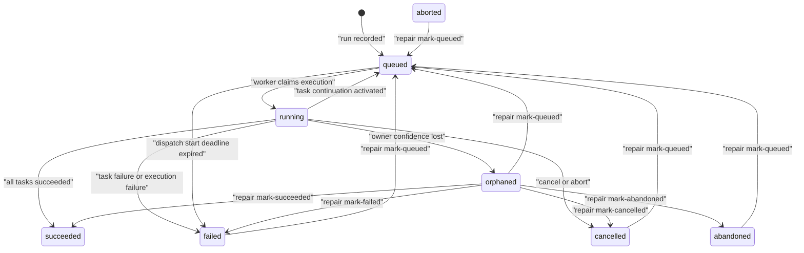

# Run, Task, And Queue State Reference

This page explains the lifecycle states operators see in `vectis-cli runs show`, `vectis-cli runs tasks`, health checks, metrics, and the SQL tables behind them. Use it when a run is queued longer than expected, marked orphaned, failed before execution starts, stuck after a task completes, or waiting for manual repair.

For field-level storage details, see the [Database Schema Reference](./database-schema.md). For step-by-step incident handling, see [Repair Runbooks](../reliability/repair-runbooks.md) and [Dispatch Visibility](../reliability/dispatch-visibility.md).

## State Model

Vectis separates durable run state from queue delivery state.



A `queued` run is not always a brand-new run. It can mean:

- A producer recorded the run and the queue handoff is pending or being retried.
- A task finished and activated child tasks, so the run returned to `queued` for continuation.
- An operator deliberately marked the run `queued` for redispatch.

The queue buffers deliveries; the database remains the authority for run, task, execution, lease, and terminal status. Duplicate queue deliveries are expected during retry and repair paths. Execution claims prevent the same `segment_executions.execution_id` from running twice.

## Run Statuses

`job_runs.status` is the aggregate lifecycle for a run.

| Status | Terminal | Meaning | Operator response |
| --- | --- | --- | --- |
| `queued` | No | The run is waiting for initial dispatch, task continuation dispatch, or manual redispatch. | Check `next_action`, dispatch events, queue backlog, and reconciler health. |
| `running` | No | A worker or orchestrator has an active execution claim, or the global catalog has observed active execution. | Check worker health, lease owner, logs, and cancellation state before intervening. |
| `orphaned` | No | Vectis lost confidence in the active owner. `orphan_reason` records the failure class. | Let the reconciler repair terminal task summaries, or use repair commands after external verification. |
| `succeeded` | Yes | All task executions reduced to success. | No repair action. Do not requeue succeeded runs. |
| `failed` | Yes | Execution failed, a security gate failed, dispatch expired, or an operator marked failure. | Inspect `failure_code`, `failure_reason`, task rows, and security events before retry. |
| `cancelled` | Yes | The API or execution path requested cancellation or observed an aborted execution. | Confirm cancellation was intended before any manual redispatch. |
| `abandoned` | Yes | Operator repair state for work intentionally left unresolved. | Use only when no authoritative completion result is expected. |
| `aborted` | Yes | Internal or catalog status for aborted work. Persisted worker aborts normally become `cancelled`. | Treat as terminal unless an operator deliberately marks it `queued`. |

Manual terminal repair commands only mark `orphaned` runs terminal:

| Command | Result |
| --- | --- |
| `vectis-cli runs repair mark-succeeded <run-id>` | Marks an orphaned run `succeeded`. |
| `vectis-cli runs repair mark-failed <run-id>` | Marks an orphaned run `failed` with `failure_code=force_failed` unless a lower-level repair path supplies a different code. |
| `vectis-cli runs repair mark-cancelled <run-id>` | Marks an orphaned run `cancelled`. |
| `vectis-cli runs repair mark-abandoned <run-id>` | Marks an orphaned run `abandoned`. |
| `vectis-cli runs repair mark-queued <run-id>` | Requeues a stuck or terminal non-success run from `queued`, `failed`, `orphaned`, `cancelled`, `abandoned`, or `aborted`. |

## Task And Execution Statuses

Run task state is stored across four related tables:

| Table | Role |
| --- | --- |
| `run_tasks` | Logical task tree. Parent and child rows model task fan-out and dependencies. |
| `task_attempts` | Concrete attempt for a task in a target cell. |
| `run_segments` | Segment-level execution mirror used by run and catalog views. |
| `segment_executions` | Claimable execution record with execution ID, lease owner, lease deadline, attempt, and start deadline. |

Task, attempt, segment, and execution rows use the same lifecycle vocabulary:

| Status | Meaning |
| --- | --- |
| `planned` | The task is known from the bound task graph but dependencies are not satisfied yet. |
| `pending` | The execution is dispatchable or waiting for acceptance. |
| `accepted` | The target execution path accepted the work but has not necessarily started it. |
| `running` | A worker has started the execution. |
| `succeeded` | Terminal success for that row. |
| `failed` | Terminal failure for that row. |
| `cancelled` | Terminal cancellation for that row. |
| `aborted` | Terminal abort from execution machinery. |

When a task succeeds, the orchestrator may activate child tasks. If children are activated, the run returns to `queued` and the worker or reconciler dispatches those child executions. When no children remain, the task reducer decides whether the run is terminal.

## Next Actions

`GET /api/v1/runs/{id}` and `vectis-cli runs show <run-id>` may include `next_action`. These values are operator-facing hints, not new states.

| `next_action` | When it appears | First response |
| --- | --- | --- |
| `security_gate_failed` | The run is `failed` and the latest worker-controlled SVID or secret-resolution event failed. | Inspect `latest_failed_security_event`; fix SPIFFE, secret provider, or policy before retry. |
| `task_completion_pending` | The run is `queued`, has task rows, and at least one task remains incomplete. | Use `vectis-cli runs tasks <run-id>` and worker metrics to find the incomplete branch. |
| `task_continuation_pending` | The run is `queued` with pending non-root task executions waiting for continuation redispatch. | Check reconciler activity, dispatch events, target cell routing, and queue backlog. |
| `task_finalization_repair_pending` | The run is `orphaned`, but the stored task summary can already reduce to success or failure. | Let `vectis-reconciler` repair it, or follow repair runbooks if the reconciler is unhealthy. |

Health check evidence uses related counters such as `task_continuation_pending` and `task_finalization_pending` for fleet-level summaries.

## Failure Codes And Reasons

`job_runs.failure_code` classifies terminal failure. `failure_reason` gives the human-readable or subsystem-provided detail.

| Failure code | Meaning | Typical source |
| --- | --- | --- |
| `execution_error` | A task execution failed or task reduction found terminal failed work. | Worker finalization or task reducer. |
| `force_failed` | An operator marked the run failed, or a repair path intentionally forced failure. | `runs repair mark-failed` or deprecated force-fail API. |
| `dispatch_expired` | The execution missed its dispatch start deadline before it could start. | Queue drop, late worker claim, or expiry scan. |
| `invalid_execution_envelope` | A persisted run reached a worker without a valid execution envelope. | Malformed queue handoff or incompatible producer. |

`job_runs.orphan_reason` explains why a nonterminal run became `orphaned`.

| Orphan reason | Meaning | First response |
| --- | --- | --- |
| `lease_expired` | The database execution lease expired before completion. | Verify worker process health and whether the task is still running externally. |
| `ack_uncertain` | The worker could not prove the queue ack, claim, preparation, or mirrored claim completed safely. | Check worker logs around acking and claiming before manual retry. |
| `worker_core_unknown` | The worker core returned an unknown or indeterminate result. | Use external evidence and logs before marking terminal or requeueing. |
| `unknown` | Fallback classification for older or unexpected orphan reasons. | Treat as manual-investigation required. |

Common reason strings include `api_cancelled` and `manual_repair`; more specific worker and repair messages may appear in `failure_reason`.

Worker-controlled security gates use these redacted event types:

| Security event type | Meaning |
| --- | --- |
| `svid_check` | The worker checked the execution SVID against the expected identity. |
| `secret_resolution` | The worker attempted to resolve declared task secrets through the secrets broker. |

## Queue Delivery States

Queue state is not stored in the SQL schema. It lives in the queue process and, when configured, the queue persistence directory.

| Queue state | Meaning | Metrics and repair signals |
| --- | --- | --- |
| Pending | A `JobRequest` is buffered and waiting for an eligible worker. | `vectis_queue_jobs_pending`; dispatch events may show `accepted` or `attempt` without `success`. |
| In-flight | The queue assigned a `delivery_id` and waits for worker ack before the delivery TTL expires. | `vectis_queue_deliveries_inflight`; worker lifecycle may be `acking` or `claiming`. |
| Acked | The worker removed the queue delivery. For persisted runs, it then relies on execution claim and lease state. | The queue no longer owns repair; inspect database run and execution state. |
| Expired requeued | An in-flight delivery exceeded delivery TTL before ack, but the dispatch start deadline has not expired. | `vectis_queue_expired_requeued_total`; repeated growth suggests slow or unhealthy workers. |
| Expired dropped | Pending or in-flight work exceeded the dispatch start deadline. The queue drops it instead of requeueing or DLQing it. | `vectis_queue_expired_dropped_total`; affected runs may fail with `dispatch_expired`. |
| Dead-lettered | An in-flight delivery exceeded max requeue attempts. | `vectis_queue_dlq_size` and `vectis_queue_dlq_moved_total`; inspect and requeue only after fixing the cause. |
| DLQ requeued | An operator requeued a dead-letter item to the main queue. | `vectis_queue_dlq_requeued_total`; the execution claim still guards duplicate execution. |

Queue delivery TTL and database execution lease TTL are separate timers. A queue delivery can expire before a worker claims execution, while a database execution lease can expire after the queue has already been acked. This is why queue metrics, dispatch events, and SQL run state must be read together.

## Dispatch Events

`run_dispatch_events` record producer handoff attempts.

| Source | Meaning |
| --- | --- |
| `api` | HTTP API or ephemeral run path created the dispatch attempt. |
| `cron` | Scheduler produced the run. |
| `reconciler` | Repair loop redispatched queued or continuation work. |

| Event type | Meaning |
| --- | --- |
| `accepted` | A producer accepted responsibility for enqueueing after the run was recorded. |
| `attempt` | A queue or cell-ingress handoff attempt started. |
| `success` | The target queue or ingress accepted the handoff. |
| `failure` | The handoff attempt failed; `message` may contain the redacted cause. |

Read the latest event sequence with the run status:

| Pattern | Interpretation |
| --- | --- |
| `accepted` only | The run was recorded, but no handoff attempt was observed yet. |
| `attempt` without `success` | The producer tried to enqueue and did not complete successfully. |
| `attempt` followed by `success` | Queue handoff succeeded; focus on queue backlog, worker dequeue, and execution claim state. |
| Repeated `reconciler` failures | The repair loop is active but cannot load, parse, enqueue, or record dispatch for the run. |

## Reducer And Finalizer Outcomes

Task reducer outcomes explain how task summaries become run outcomes.

| Reducer outcome | Meaning |
| --- | --- |
| `waiting` | Some tasks are still incomplete and no terminal failure has won. |
| `succeeded` | All tracked task executions succeeded. |
| `failed` | At least one tracked task execution reached terminal failure. |

Task finalizer metrics add the transition decision:

| Finalizer outcome | Meaning |
| --- | --- |
| `continue` | Child tasks were activated and the run should continue. |
| `reduce_succeeded` | The reducer reached success and the run can become `succeeded`. |
| `reduce_failed` | The reducer reached failure and the run can become `failed`. |
| `incomplete` | No continuation was activated, but the task graph is not terminal yet. |
| `execution_failed` | The current execution failed before normal reduction completed. |
| `execution_aborted` | The current execution was aborted or cancelled. |

These outcomes appear in `vectis_task_reduce_decisions_total` and `vectis_task_finalize_decisions_total`.

## Operator Triage Path

Start from the durable run view:

```bash
vectis-cli runs show <run-id>
vectis-cli runs tasks <run-id>
```

Then correlate:

| Question | Where to look |
| --- | --- |
| Did a producer try to enqueue? | `dispatch_events`, `dispatch_summary`, `vectis_run_dispatch_events_total` |
| Is the queue holding or redelivering work? | `vectis_queue_jobs_pending`, `vectis_queue_deliveries_inflight`, DLQ metrics |
| Are workers consuming and claiming? | `vectis_worker_jobs_received_total`, worker lifecycle metrics, worker logs |
| Did task fan-out create pending children? | `next_action`, `runs tasks`, `task_completion`, reconciler metrics |
| Is the run repairable automatically? | `next_action=task_finalization_repair_pending`, `vectis_reconciler_task_finalization_repairs_total` |
| Is a security gate the real failure? | `latest_failed_security_event`, `execution_security_events`, secrets and SPIFFE metrics |

Prefer narrow, evidence-backed repair:

1. Let the reconciler handle old queued runs and terminal orphaned task summaries when it is healthy.
2. Use `runs repair mark-queued` only when duplicate execution is safe or the database claim path will reject stale duplicates.
3. Use terminal repair marks only for `orphaned` runs after external evidence confirms the outcome.
4. Do not requeue `succeeded` runs.

## Multi-Cell Notes

The owning cell is authoritative for active execution state. Global catalog views can lag if `vectis-catalog` is behind or a source cell cannot fan in events. In multi-cell incidents, compare:

| Field or endpoint | Use |
| --- | --- |
| `owning_cell` | Cell that owns the run's execution state. |
| `requested_cells` | Cells requested by the producer when the run was created. |
| `GET /api/v1/cells/status` | Per-cell ingress, dispatch, queued-run, continuation, and catalog pressure. |
| `GET /api/v1/catalog/status` | Pending or failed catalog inbox pressure. |

Catalog status application is monotonic for normal execution progress: nonterminal execution states advance from `planned` to `pending` to `accepted` to `running`, and terminal states win over nonterminal states. Conflicting terminal updates require investigation at the owning cell.

## Related Docs

| Need | Doc |
| --- | --- |
| SQL fields and constraints | [Database Schema Reference](./database-schema.md) |
| Metrics names and label values | [Metrics Catalog](./metrics-catalog.md) |
| API fields for run and task views | [API Reference](../../using/api-reference.md) |
| Machine-readable HTTP contract | [OpenAPI Specification](../../using/openapi-specification.md) |
| Dispatch event interpretation | [Dispatch Visibility](../reliability/dispatch-visibility.md) |
| Manual repair procedures | [Repair Runbooks](../reliability/repair-runbooks.md) |
| Queue and database ownership rationale | [ADR 0003: Database Claims And Queue Deliveries](../../developing/architecture-decisions/0003-database-claims-and-queue-deliveries.md) |
